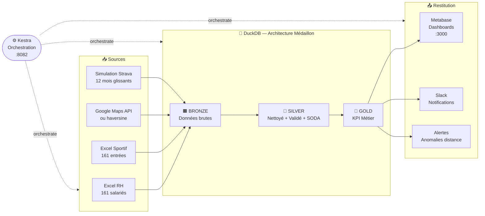
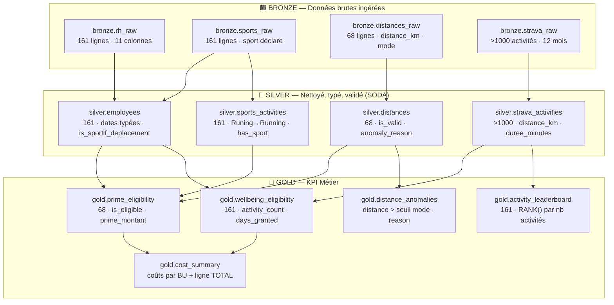
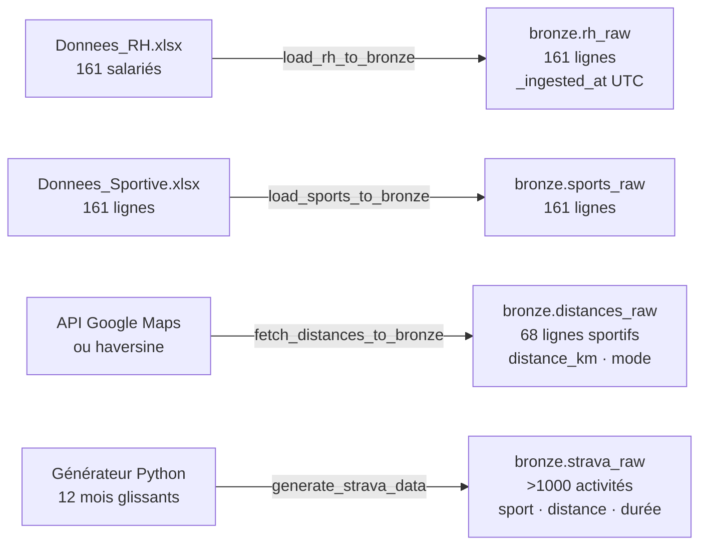
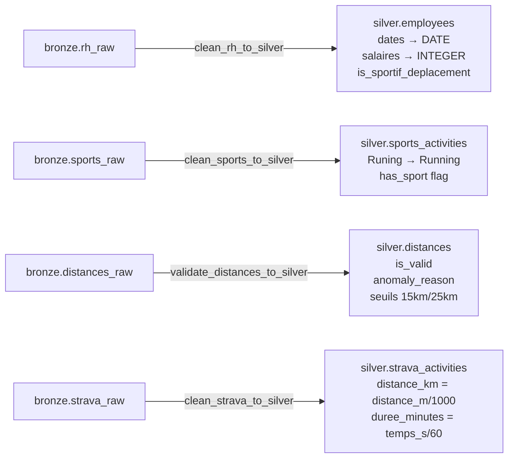
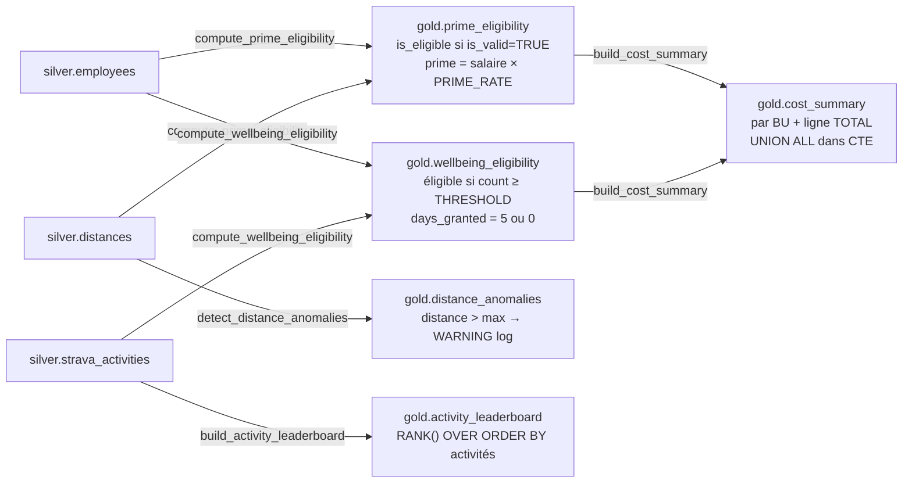
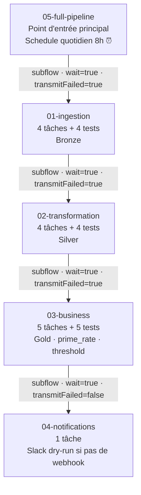
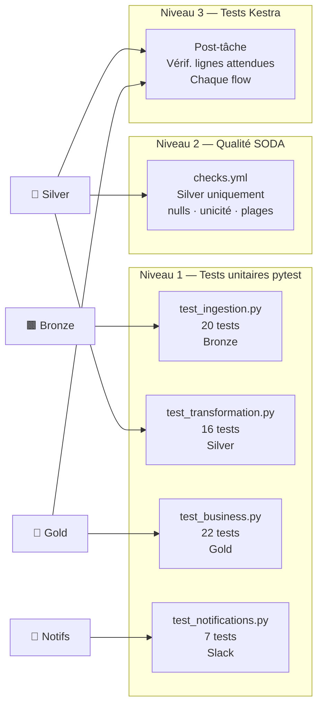

# 🏃 POC Avantages Sportifs — Sport Data Solution


*Pipeline data end-to-end pour évaluer et calculer les avantages sportifs des salariés de Sport Data Solution.*

---

## 📑 Table des matières

- 1. [Contexte](#-contexte)
  - 1.1 [Avantages proposés](#avantages-proposés)
  - 1.2 [Périmètre des données](#périmètre-des-données)
- 2. [Architecture](#️-architecture)
  - 2.1 [Vue d'ensemble](#vue-densemble)
  - 2.2 [Architecture Medallion Bronze → Silver → Gold](#architecture-medallion-bronze--silver--gold)
- 3. [Stack technique](#️-stack-technique)
- 4. [Installation et démarrage](#-installation-et-démarrage)
  - 4.1 [Prérequis](#prérequis)
  - 4.2 [Démarrage Docker](#démarrage-docker)
  - 4.3 [Exécution locale (sans Docker)](#exécution-locale-sans-docker)
- 5. [Configuration](#️-configuration)
  - 5.1 [Variables d'environnement](#variables-denvironnement)
  - 5.2 [Modes de fonctionnement](#modes-de-fonctionnement)
  - 5.3 [Paramètres dynamiques](#paramètres-dynamiques)
- 6. [Pipeline de données](#-pipeline-de-données)
  - 6.1 [Ingestion (Bronze)](#ingestion-bronze)
  - 6.2 [Transformation (Silver)](#transformation-silver)
  - 6.3 [Calculs métier (Gold)](#calculs-métier-gold)
  - 6.4 [Notifications Slack](#notifications-slack)
- 7. [Orchestration Kestra](#-orchestration-kestra)
- 8. [Tests](#-tests)
- 9. [Structure du projet](#-structure-du-projet)
- 10. [Démo live soutenance](#-démo-live-soutenance)
- 11. [Troubleshooting](#-troubleshooting)
- 12. [Évolutions possibles](#-évolutions-possibles)

---

## 📋 Contexte

Sport Data Solution souhaite récompenser les salariés ayant une pratique sportive régulière via deux avantages RH.

### Avantages proposés

| Avantage | Montant | Condition d'éligibilité |
|----------|---------|------------------------|
| **Prime sportive** | 5 % du salaire annuel brut | Déplacement domicile-bureau en mode sportif (vélo, marche, trottinette) **et** distance cohérente avec le mode |
| **5 jours bien-être** | 5 jours de congé supplémentaires/an | ≥ 15 activités physiques déclarées sur les 12 derniers mois |

Ce POC vise à tester la faisabilité technique, collecter les bonnes données et mesurer l'impact financier avant un déploiement RH réel.

### Périmètre des données

| Source | Contenu | Couverture |
|--------|---------|-----------|
| Fichier RH Excel | 161 salariés, 11 colonnes | Identité, BU, salaire, adresse, moyen de déplacement |
| Fichier Sportif Excel | 161 lignes | ID salarié + sport déclaré |
| API Google Maps (ou haversine) | Distances domicile-bureau | 68 salariés sportifs uniquement |
| Simulation Strava | Activités sur 12 mois glissants | > 1 000 entrées pour les 68 sportifs |

[↑ Retour au sommaire](#-table-des-matières)

---

## 🏗️ Architecture

### Vue d'ensemble



### Architecture Medallion Bronze → Silver → Gold



[↑ Retour au sommaire](#-table-des-matières)

---

## 🛠️ Stack technique

| Composant | Rôle | Justification |
|-----------|------|---------------|
|  **Python 3.11+** | Pipeline ETL | Standard data engineering, écosystème riche, type hints |
|  **DuckDB** | Base analytique | Zéro serveur, SQL complet, schemas Bronze/Silver/Gold dans un seul fichier |
|  **Kestra** | Orchestration + monitoring | Flows YAML, UI web, scheduling, retry, logs intégrés |
|  **Metabase** | Dashboards | Open-source, driver DuckDB communautaire, démo live |
|  **Docker Compose** | Infrastructure | Déploiement en une commande, 4 services isolés |
|  **SODA Core** | Tests qualité données | Checks déclaratifs YAML sur la couche Silver |
|  **pytest** | Tests unitaires | 65 tests couvrant les 4 couches du pipeline |

[↑ Retour au sommaire](#-table-des-matières)

---

## 🚀 Installation et démarrage

### Prérequis

- **Docker & Docker Compose** — pour l'infrastructure complète
- **Python 3.11+** — pour le développement et les tests locaux
- **Clé API Google Maps** *(optionnelle)* — sans clé, les distances sont calculées par haversine

### Démarrage Docker

```bash
# 1. Cloner le repo
git clone <repo-url>
cd poc-avantages-sportifs

# 2. Configurer l'environnement
cp .env.example .env
# Optionnel : éditer .env pour ajouter GOOGLE_MAPS_API_KEY / SLACK_WEBHOOK_URL

# 3. Construire les images Docker personnalisées
#    (Metabase avec driver DuckDB + image pipeline)
docker-compose build

# 4. Démarrer l'infrastructure (PostgreSQL + Kestra + Metabase)
docker-compose up -d

# 5. Vérifier que tout tourne
docker-compose ps

# 6. Lancer le pipeline Bronze → Silver → Gold via Docker
docker-compose run --rm pipeline-sports run

# 7. Vérifier le statut des tables
docker-compose run --rm pipeline-sports status
```

### Accès aux services

| Service | URL | Description |
|---------|-----|-------------|
| Kestra UI | http://localhost:8082 | Orchestration & monitoring des flows |
| Metabase | http://localhost:3000 | Dashboards KPI |
| PostgreSQL | localhost:5433 | Backend interne Kestra |

### Exécution locale (sans Docker)

```bash
# Créer l'environnement Python
python -m venv .venv
source .venv/bin/activate   # Linux/Mac
pip install -r requirements.txt

# Pipeline complet Bronze → Silver → Gold
python main.py run

# Avec notifications Slack
python main.py run --notify

# Override des paramètres métier (one-shot, sans modifier .env)
python main.py run --prime-rate 0.08 --threshold 10

# Statut des tables DuckDB
python main.py status

# Notifications pour les activités des dernières 24h
python main.py notify

# Notification pour une activité spécifique (démo live)
python main.py notify --id 42

# Lancer les tests
python -m pytest src/tests/ -v
```

[↑ Retour au sommaire](#-table-des-matières)

---

## ⚙️ Configuration

### Variables d'environnement

Copier `.env.example` en `.env` :

```bash
cp .env.example .env
```

| Variable | Défaut | Obligatoire | Description |
|----------|--------|-------------|-------------|
| `GOOGLE_MAPS_API_KEY` | *(vide)* | Non | Clé API Distance Matrix — sans clé : haversine |
| `SLACK_WEBHOOK_URL` | *(vide)* | Non | Webhook Slack — sans webhook : dry-run dans les logs |
| `DUCKDB_PATH` | `data/sports_poc.duckdb` | Non | Chemin vers le fichier DuckDB |
| `PRIME_RATE` | `0.05` | Non | Taux de la prime sportive (5 %) |
| `WELLBEING_THRESHOLD` | `15` | Non | Nombre min d'activités pour les jours bien-être |
| `WALK_MAX_DISTANCE_KM` | `15` | Non | Distance max éligible marche/running |
| `BIKE_MAX_DISTANCE_KM` | `25` | Non | Distance max éligible vélo/trottinette |
| `COMPANY_ADDRESS` | `1362 Avenue des Platanes, 34970 Lattes` | Non | Adresse de référence pour le calcul des distances |

### Modes de fonctionnement

Le pipeline est **100 % fonctionnel dans les deux modes** — aucune clé API n'est nécessaire pour démarrer.

| Mode | Google Maps | Slack | Cas d'usage |
|------|-------------|-------|-------------|
| **Mode autonome** *(défaut)* | Haversine — distances à vol d'oiseau | Dry-run — messages dans les logs | Développement, tests, démo rapide |
| **Mode complet** | API réelle — distances routières/piétonnes/cyclistes | Webhook — messages envoyés aux salariés | Production, démo client |

**Mode autonome :** `cp .env.example .env` sans modification suffit. Les distances haversine sont légèrement inférieures aux distances réelles mais cohérentes pour la validation des éligibilités.

**Mode complet :** renseigner dans `.env` :
```env
GOOGLE_MAPS_API_KEY=AIzaSy...
SLACK_WEBHOOK_URL=https://hooks.slack.com/services/...
```

### Paramètres dynamiques

Ces valeurs sont modifiables **sans toucher au code**, via `.env` ou les arguments CLI :

| Paramètre | Valeur par défaut | Effet |
|-----------|-------------------|-------|
| `PRIME_RATE` | `0.05` | Taux de la prime (5 % → 8 % change le coût total) |
| `WELLBEING_THRESHOLD` | `15` | Seuil d'activités (14 vs 15 peut changer des dizaines d'éligibles) |
| `WALK_MAX_DISTANCE_KM` | `15` | Au-delà : anomalie détectée, salarié non éligible à la prime |
| `BIKE_MAX_DISTANCE_KM` | `25` | Au-delà : idem |

**Modifier en live (sans relancer l'infrastructure) :**

```bash
# Option 1 — via CLI (one-shot, ne modifie pas .env)
python main.py run --prime-rate 0.08 --threshold 10

# Option 2 — via .env (persistant)
# 1. Éditer .env : PRIME_RATE=0.08
# 2. Relancer : python main.py run
```

[↑ Retour au sommaire](#-table-des-matières)

---

## 🔄 Pipeline de données

### Ingestion (Bronze)



**Principes d'ingestion :**
- Colonnes normalisées en `snake_case` (accents supprimés, espaces → `_`)
- Timestamp `_ingested_at` ajouté sur chaque ligne
- `CREATE OR REPLACE TABLE` — idempotent, relançable sans effet de bord
- Distances calculées uniquement pour les 68 salariés avec mode de déplacement sportif

### Transformation (Silver)



**Transformations clés :**

| Table Silver | Transformation | Règle |
|---|---|---|
| `employees` | Types SQL stricts | `date_naissance` → `DATE`, `salaire_brut` → `INTEGER` |
| `employees` | Flag sportif | `is_sportif_deplacement = TRUE` si mode ∈ {Marche/running, Vélo/Trottinette/Autres} |
| `sports_activities` | Correction coquilles | `'Runing'` → `'Running'` |
| `distances` | Validation seuils | Marche ≤ 15 km, Vélo ≤ 25 km — au-delà : `is_valid = FALSE` |
| `strava_activities` | Unités SI → lisibles | `distance_km`, `duree_minutes` calculés |

### Calculs métier (Gold)



**Règles métier :**

| KPI | Éligibilité | Calcul |
|-----|-------------|--------|
| Prime sportive | Mode sportif + distance valide | `salaire_brut × PRIME_RATE` (0 si non éligible) |
| Jours bien-être | `activity_count ≥ WELLBEING_THRESHOLD` | `days_granted = 5` (0 sinon) |
| Anomalie distance | `distance_km > max_distance_km` | Logue en WARNING + insère dans `distance_anomalies` |

### Notifications Slack

Après le pipeline Gold, les messages Slack sont générés pour chaque activité récente :

- **Template déterministe** : `MD5(nom) % len(templates)` → varié mais reproductible
- **Avec/sans distance** selon le sport (Running → distance, Yoga → pas de distance)
- **Durée formatée** : `< 60 min → "45 min"` | `≥ 60 min → "1h30min"`
- **Mode dry-run** si `SLACK_WEBHOOK_URL` absent — messages dans les logs

```bash
python main.py notify           # activités des 24 dernières heures
python main.py notify --id 42   # activité spécifique (démo live)
```

[↑ Retour au sommaire](#-table-des-matières)

---

## ⚡ Orchestration Kestra



| Flow | ID Kestra | Tâches | Paramètres |
|------|-----------|--------|------------|
| `01_ingestion.yml` | `01-ingestion` | load_rh, load_sports, fetch_distances, generate_strava + 4 tests | `db_path` |
| `02_transformation.yml` | `02-transformation` | clean_rh, clean_sports, validate_distances, clean_strava + 4 tests | `db_path` |
| `03_business.yml` | `03-business` | compute_prime, compute_wellbeing, detect_anomalies, build_summary, build_leaderboard + 5 tests | `db_path`, `prime_rate`, `wellbeing_threshold` |
| `04_notifications.yml` | `04-notifications` | notify_recent_activities | `db_path`, `hours`, `webhook_url` |
| `05_full_pipeline.yml` | `05-full-pipeline` | Subflows 1→4 + print_summary | Propage toutes les variables |

**Volumes montés dans Kestra :**
- `./src` → `/app/src` — code source Python importé par les flows
- `./data` → `/app/data` — fichier DuckDB partagé
- `./input` → `/app/input` — fichiers Excel sources
- `./kestra/flows` → `/app/flows` — flows YAML chargés au démarrage

[↑ Retour au sommaire](#-table-des-matières)

---

## 🧪 Tests



### Couverture actuelle — 65 tests

```bash
python -m pytest src/tests/ -v
# ============================== 65 passed in ~3s ==============================
```

| Fichier | Tests | Ce qui est validé |
|---------|-------|-------------------|
| `test_ingestion.py` | 20 | 161 lignes RH/Sportif, snake_case, `_ingested_at`, Strava > 1 000, distances 68 lignes, haversine Lattes/Nîmes |
| `test_transformation.py` | 16 | `employees` 161 lignes, 68 sportifs, `Runing` corrigé, `is_valid` distances, `distance_km` exact |
| `test_business.py` | 22 | Prime = salaire × 5 %, taux custom 10 % = 2×, seuil 14 vs 15, 5 BU + TOTAL, RANK() commence à 1 |
| `test_notifications.py` | 7 | Format messages avec/sans distance/commentaire, durée, dry-run retourne False |

### Tests SODA (couche Silver)

Fichier : `src/tests/soda/checks.yml` — exécuté dans le flow `02-transformation` Kestra.

Checks implémentés :
- Distances ≥ 0 et cohérentes avec le mode de déplacement
- Dates valides et non futures
- Unicité de `id_salarie` dans `silver.employees`
- Salaires dans la plage réaliste (25 000 – 80 000 €)
- Absence de valeurs nulles sur les champs critiques

[↑ Retour au sommaire](#-table-des-matières)

---

## 📁 Structure du projet

```
poc-avantages-sportifs/
├── input/
│   ├── Donnees_RH.xlsx           # 161 salariés, 11 colonnes
│   └── Donnees_Sportive.xlsx     # 161 lignes, ID + sport
├── src/
│   ├── ingestion/                # Bronze : chargement brut
│   │   ├── load_excel.py         # load_rh_to_bronze / load_sports_to_bronze
│   │   ├── fetch_distances.py    # fetch_distances_to_bronze (API ou haversine)
│   │   └── generate_strava.py    # generate_strava_data (simulation 12 mois)
│   ├── transformation/           # Silver : nettoyage + validation
│   │   ├── clean_rh.py           # clean_rh_to_silver
│   │   ├── clean_sports.py       # clean_sports_to_silver
│   │   ├── validate_distances.py # validate_distances_to_silver
│   │   ├── clean_strava.py       # clean_strava_to_silver
│   │   └── __init__.py           # run_all_transformations()
│   ├── business/                 # Gold : KPI + éligibilité
│   │   ├── compute_prime.py      # compute_prime_eligibility()
│   │   ├── compute_wellbeing.py  # compute_wellbeing_eligibility()
│   │   ├── detect_anomalies.py   # detect_distance_anomalies()
│   │   ├── build_summary.py      # build_cost_summary / build_activity_leaderboard
│   │   └── __init__.py           # run_all_business()
│   ├── notifications/
│   │   └── slack_messenger.py    # format / send / notify_recent / notify_single
│   ├── tests/
│   │   ├── test_ingestion.py     # 20 tests
│   │   ├── test_transformation.py# 16 tests
│   │   ├── test_business.py      # 22 tests
│   │   ├── test_notifications.py # 7 tests
│   │   └── soda/checks.yml       # SODA quality checks Silver
│   └── utils/
│       ├── db.py                 # db_session() — connexion DuckDB context manager
│       ├── logger.py             # get_logger() — format standardisé
│       └── config.py             # PRIME_RATE, WELLBEING_THRESHOLD, seuils distance
├── kestra/flows/
│   ├── 01_ingestion.yml
│   ├── 02_transformation.yml
│   ├── 03_business.yml
│   ├── 04_notifications.yml
│   └── 05_full_pipeline.yml
├── docker/
│   ├── Dockerfile.pipeline       # python:3.11-slim — image pipeline ETL
│   └── metabase/
│       └── Dockerfile.metabase   # Metabase + driver DuckDB v1.5.1.0
├── scripts/
│   ├── start.sh                  # Démarre infra + attend Metabase + lance pipeline
│   └── demo.sh                   # Injection activité fictive + notification Slack
├── docs/
│   └── architecture.md           # Documentation technique détaillée
├── main.py                       # CLI argparse : run / notify / status
├── docker-compose.yml            # 4 services : postgres · kestra · metabase · pipeline
├── .env.example                  # Template de configuration commenté
├── requirements.txt
└── pytest.ini
```

[↑ Retour au sommaire](#-table-des-matières)

---

## 🎯 Démo live soutenance

### Scénario 1 — Changer le taux de prime en direct

```bash
# État initial (résumé pipeline avec 5%)
python main.py status

# Recalcul avec taux 8%
python main.py run --prime-rate 0.08

# Observer l'impact :
# Prime sportive : XX éligibles | Coût total : YYY € (×1.6 vs 5%)
```

**Ce qui change :** `gold.prime_eligibility.prime_montant` est recalculé en temps réel.
Le même salarié qui touchait 2 500 € touche maintenant 4 000 €.

### Scénario 2 — Insérer une nouvelle activité et déclencher une notification

```bash
# Étape 1 : injecter une activité Running fictive dans Bronze
python - <<'EOF'
import duckdb
from datetime import datetime, timezone

conn = duckdb.connect("data/sports_poc.duckdb")
now = datetime.now(timezone.utc).replace(tzinfo=None)

# Récupérer un ID de salarié Marche/running existant
id_salarie = conn.execute("""
    SELECT id_salarie FROM silver.employees
    WHERE moyen_deplacement = 'Marche/running' LIMIT 1
""").fetchone()[0]

conn.execute("""
    INSERT INTO bronze.strava_raw
        (id_salarie, sport_type, distance_m, temps_ecoule_s, date_debut, commentaire, _ingested_at)
    VALUES (?, 'Run', 12000, 3300, ?, 'Belle sortie matinale !', ?)
""", [id_salarie, now, now])
conn.close()
print(f"Activité insérée pour id_salarie={id_salarie}")
EOF

# Étape 2 : recalculer Silver (Strava) + Gold
python - <<'EOF'
from src.transformation.clean_strava import clean_strava_to_silver
from src.business import run_all_business
clean_strava_to_silver("data/sports_poc.duckdb")
run_all_business("data/sports_poc.duckdb")
EOF

# Étape 3 : envoyer la notification Slack (dry-run si pas de webhook)
python main.py notify
```

Ou en une commande avec le script prêt à l'emploi :

```bash
./scripts/demo.sh
```

### Scénario 3 — Observer dans Metabase

1. Ouvrir **http://localhost:3000**
2. Connecter la base DuckDB : chemin `/data/sports_poc.duckdb`
3. Explorer les tables `gold.*` :
   - `gold.prime_eligibility` — liste des éligibles avec montant
   - `gold.wellbeing_eligibility` — compteur d'activités par salarié
   - `gold.cost_summary` — coût total par BU
   - `gold.activity_leaderboard` — classement des salariés
4. Après chaque `python main.py run`, actualiser les questions Metabase pour voir les changements

[↑ Retour au sommaire](#-table-des-matières)

---

## 🔧 Troubleshooting

### PostgreSQL 18+ — erreur de volume

**Symptôme :** Kestra ou PostgreSQL ne démarre pas, logs indiquent une erreur d'initialisation du répertoire.

**Cause :** PostgreSQL 18 a modifié sa structure interne de stockage. Monter le volume sur `/var/lib/postgresql/data` est incompatible avec la nouvelle arborescence.

```yaml
# ✅ Correct — docker-compose.yml actuel
volumes:
  - postgres_sports_data:/var/lib/postgresql

# ❌ Incompatible avec PostgreSQL 18+
# volumes:
#   - postgres_sports_data:/var/lib/postgresql/data
```

Si le problème persiste (volume corrompu depuis une ancienne version) :

```bash
docker-compose down -v     # supprime tous les volumes (données perdues)
docker-compose up -d       # recrée depuis zéro
```

### Kestra — storage non configuré

**Symptôme :** Kestra démarre mais les flows échouent dès la première tâche.

**Cause :** En mode `server standalone`, la propriété `kestra.storage` est obligatoire depuis les versions récentes.

```yaml
# Configuration correcte dans docker-compose.yml
KESTRA_CONFIGURATION: |
  kestra:
    storage:
      type: local
      local:
        base-path: /app/storage   # volume kestra_sports_data monté ici
    repository:
      type: postgres
    queue:
      type: postgres
```

### Conflits de ports Docker

**Diagnostiquer :**

```bash
# Voir tous les ports des conteneurs actifs
docker ps --format "table {{.Names}}\t{{.Ports}}"

# Vérifier si un port local est occupé
lsof -i :8082    # Kestra UI
lsof -i :3000    # Metabase
lsof -i :5433    # PostgreSQL Kestra
```

**Résoudre :** modifier le port **externe** dans `docker-compose.yml` :

```yaml
ports:
  - "8084:8080"   # utiliser 8084 au lieu de 8082
```

### Metabase — driver DuckDB absent

**Symptôme :** DuckDB n'apparaît pas dans la liste des bases de données Metabase.

**Cause :** Le `docker-compose build` n'a pas été exécuté — l'image utilisée est `metabase/metabase:latest` sans le driver.

```bash
# Reconstruire l'image avec le driver
docker-compose build metabase-sports
docker-compose up -d metabase-sports

# Vérifier le chargement du driver dans les logs
docker-compose logs metabase-sports | grep -i duckdb
```

[↑ Retour au sommaire](#-table-des-matières)

---

## 📈 Évolutions possibles

| Composant | Actuel (POC) | Évolution production |
|-----------|--------------|---------------------|
| **Base de données** | DuckDB local (fichier) | MotherDuck (DuckDB cloud, multi-utilisateurs) |
| **Source activités** | Simulation Python (12 mois) | API Strava réelle (OAuth2) |
| **Notifications** | Slack webhook entrant | Slack App complète (boutons, threads) |
| **Dashboards** | Metabase local | Metabase Cloud ou PowerBI |
| **Orchestration** | Kestra local | Kestra Cloud ou Enterprise (HA, secrets vault) |
| **Distances** | Haversine / Distance Matrix API | OSRM auto-hébergé (gratuit, open-source) |
| **Données RH** | Fichiers Excel manuels | Connecteur SIRH (Lucca, SAP, BambooHR) |

---

## 🔀 Git Workflow

```
main (prod) ◄──── merge uniquement par le développeur
  │
  └── develop (dev) ◄──── tous les commits ici
```

- **`main`** : branche de production, jamais de commit direct
- **`develop`** : branche de développement active
- Commits au format **Conventional Commits** : `type(scope): description en français`
- Types : `feat`, `fix`, `refactor`, `test`, `docs`, `chore`, `ci`

---

---

👤 Auteur

**Abd Selam M'BODJ** — Data Engineer

[](https://www.linkedin.com/in/mbodj)

*Responsable du POC Avantages Sportifs*