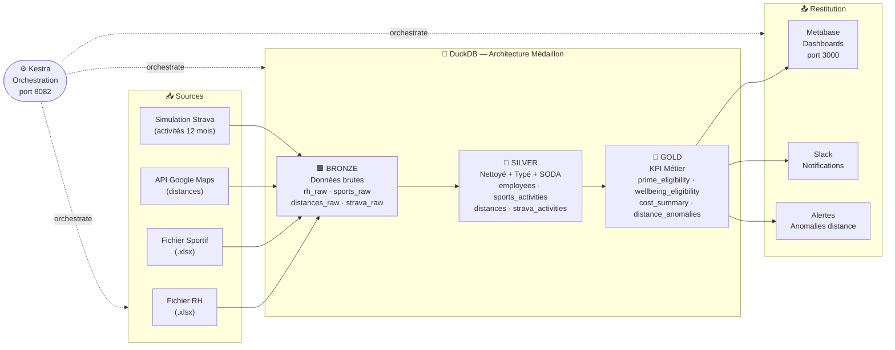

# 🏃 POC Avantages Sportifs — Sport Data Solution

> Pipeline data end-to-end pour évaluer et calculer les avantages sportifs des salariés.

---

## 📋 Contexte

Sport Data Solution souhaite récompenser les salariés ayant une pratique sportive régulière via deux avantages :

| Avantage | Description | Condition d'éligibilité |
|----------|-------------|------------------------|
| **Prime sportive** | 5% du salaire annuel brut | Déplacement domicile-bureau en mode sportif (vélo, marche, trottinette...) avec distance cohérente |
| **5 jours bien-être** | Jours de congé supplémentaires | ≥ 15 activités physiques déclarées sur les 12 derniers mois |

Ce POC vise à tester la faisabilité technique, collecter les bonnes données et mesurer l'impact financier.

---

## 🏗️ Architecture



---

## 🛠️ Stack technique

| Composant | Rôle | Justification |
|-----------|------|---------------|
| **Python 3.11+** | Pipeline ETL | Standard data engineering, écosystème riche |
| **DuckDB** | Base analytique | Zéro serveur, SQL standard, schemas Bronze/Silver/Gold |
| **Kestra** | Orchestration + monitoring | Flows YAML, UI web, logs, alertes, retry intégrés |
| **Metabase** | Dashboards | Open-source, connecteur DuckDB, démo live |
| **Docker Compose** | Infrastructure | Déploiement en une commande |
| **SODA Core** | Tests qualité données | Checks déclaratifs YAML |
| **pytest** | Tests unitaires | Tests fonctions métier Python |

---

## 🚀 Démarrage rapide

### Prérequis
- Docker & Docker Compose
- Python 3.11+
- Clé API Google Maps (optionnelle — sans clé, le pipeline fonctionne en mode simulation haversine)

### Installation

```bash
# Cloner le repo
git clone <repo-url>
cd poc-avantages-sportifs

# Créer l'environnement Python
python -m venv .venv
source .venv/bin/activate  # Linux/Mac
pip install -r requirements.txt

# Lancer l'infrastructure
docker-compose up -d

# Vérifier que tout tourne
docker-compose ps
```

### Accès aux services

| Service | URL | Description |
|---------|-----|-------------|
| Kestra UI | http://localhost:8082 | Orchestration & monitoring |
| Metabase | http://localhost:3000 | Dashboards KPI |

### Configuration

```bash
cp .env.example .env
# Éditer .env selon le mode souhaité (voir section Configuration ci-dessous)
```

### Lancer les scripts manuellement

```bash
# --- Couche Bronze (Ingestion) ---

# Ingestion Excel → Bronze (RH + Sportif)
python -m src.ingestion.load_excel

# Calcul distances domicile-bureau → Bronze (mode simulation sans clé)
python -m src.ingestion.fetch_distances

# Génération données Strava simulées → Bronze
python -m src.ingestion.generate_strava

# --- Couche Silver (Transformation) ---

# Toutes les transformations Bronze → Silver en une commande
python -c "from src.transformation import run_all_transformations; run_all_transformations()"

# Ou module par module :
python -m src.transformation.clean_rh
python -m src.transformation.clean_sports
python -m src.transformation.validate_distances
python -m src.transformation.clean_strava

# --- Couche Gold (Calculs métier) ---

# Tous les calculs Silver → Gold en une commande
python -c "from src.business import run_all_business; run_all_business()"

# Ou module par module :
python -m src.business.compute_prime
python -m src.business.compute_wellbeing
python -m src.business.detect_anomalies
python -m src.business.build_summary

# --- Pipeline complet en local (sans Kestra) ---

# Pipeline complet Bronze → Silver → Gold
python main.py run

# Avec notifications Slack
python main.py run --notify

# Override des paramètres métier
python main.py run --prime-rate 0.08 --threshold 10

# Notifications seules (activités des 24h)
python main.py notify

# Notification pour une activité spécifique (démo live)
python main.py notify --id 42

# Statut du pipeline (lignes par table)
python main.py status

# --- Tests ---

# Lancer tous les tests (ingestion + transformation + business + notifications)
python -m pytest src/tests/ -v
```

---

## ⚙️ Configuration

### Deux modes de fonctionnement

Le pipeline est **100% fonctionnel dans les deux modes** — aucune clé API n'est requise pour démarrer.

| Mode | Google Maps | Slack | Cas d'usage |
|------|-------------|-------|-------------|
| **Mode complet** | Clé API configurée → distances réelles (routières) | Webhook configuré → messages envoyés | Production, démo client |
| **Mode autonome** (défaut) | Pas de clé → calcul haversine (distances à vol d'oiseau) | Pas de webhook → messages loggés en WARNING | Développement, tests, démo rapide |

#### Mode autonome (sans clé API)

C'est le comportement par défaut dès `cp .env.example .env` sans modification :

- **Distances** : calculées par la formule haversine entre l'adresse du salarié et `1362 Av. des Platanes, 34970 Lattes`. Les distances sont approximatives (à vol d'oiseau), légèrement inférieures aux distances réelles.
- **Slack** : les messages de félicitations sont générés et affichés dans les logs (`WARNING: Mode dry-run`) mais aucun appel réseau n'est effectué. Utile pour vérifier le contenu des messages sans webhook.

#### Mode complet (avec clés API)

Renseigner les variables optionnelles dans `.env` :

```bash
# Distances réelles (routières, piétonnes, cyclistes)
GOOGLE_MAPS_API_KEY=AIza...

# Messages Slack envoyés aux salariés
SLACK_WEBHOOK_URL=https://hooks.slack.com/services/...
```

### Variables d'environnement

#### Slack (optionnel)

Sans webhook configuré : mode dry-run, messages générés dans les logs mais non envoyés.

Pour obtenir un webhook Incoming Webhooks : https://api.slack.com/apps → créer une app → Incoming Webhooks → Activate.

```env
SLACK_WEBHOOK_URL=https://hooks.slack.com/services/T.../B.../...
```

#### Google Maps (optionnel)

Sans clé : distances simulées par haversine (vol d'oiseau). Résultats cohérents pour la démo.

Pour obtenir une clé : [Google Cloud Console](https://console.cloud.google.com) → APIs & Services → Bibliothèque → Distance Matrix API. Attention : facturation après le free tier.

```env
GOOGLE_MAPS_API_KEY=AIzaSy...
```

#### Base de données

```env
DUCKDB_PATH=data/sports_poc.duckdb
```

Chemin vers le fichier DuckDB local. Modifiable pour pointer vers un fichier partagé ou monté en volume Docker.

#### Paramètres métier

Ces valeurs pilotent directement les calculs Gold. Elles peuvent être modifiées pour la démo live **sans toucher au code**.

```env
PRIME_RATE=0.05              # Taux de la prime sportive (5% par défaut)
WELLBEING_THRESHOLD=15       # Nb minimum d'activités pour les jours bien-être
WALK_MAX_DISTANCE_KM=15      # Distance max éligible en marche/running
BIKE_MAX_DISTANCE_KM=25      # Distance max éligible en vélo/trottinette
COMPANY_ADDRESS=1362 Avenue des Platanes, 34970 Lattes
```

### Changer les paramètres pour la démo live

**Option 1 — via `.env`** (persistant) :

```bash
# Modifier .env
PRIME_RATE=0.08
WELLBEING_THRESHOLD=10

# Relancer le pipeline
python main.py run
```

**Option 2 — via les arguments CLI** (one-shot, sans modifier `.env`) :

```bash
python main.py run --prime-rate 0.08 --threshold 10
```

Les arguments CLI ont priorité sur les variables d'environnement.

---

## 📁 Structure du projet

```
poc-avantages-sportifs/
├── input/                    # Données sources Excel
│   ├── Donnees_RH.xlsx       # 161 salariés, 11 colonnes
│   └── Donnees_Sportive.xlsx # 161 lignes, ID + sport
├── src/
│   ├── ingestion/            # Bronze : chargement brut
│   ├── transformation/       # Silver : nettoyage + qualité
│   ├── business/             # Gold : KPI + éligibilité
│   ├── notifications/        # Messages Slack
│   ├── tests/                # pytest + SODA checks
│   └── utils/                # Connexion DB, logging
├── kestra/flows/             # Flows d'orchestration YAML
├── docker/
│   ├── Dockerfile.pipeline           # Image Python pipeline ETL
│   └── metabase/
│       └── Dockerfile.metabase       # Metabase + driver DuckDB v1.5.1.0
├── scripts/
│   ├── start.sh              # Démarrage infra + pipeline complet
│   └── demo.sh               # Démo live (injection activité + notification)
├── docker-compose.yml        # Infrastructure complète
└── docs/                     # Documentation technique
```

---

## 🔄 Flows Kestra

| Flow | Description | Entrée | Sortie |
|------|-------------|--------|--------|
| `01_ingestion` | Charge les Excel + API → Bronze | Fichiers Excel, API | `bronze.*` |
| `02_transformation` | Nettoie + teste → Silver | `bronze.*` | `silver.*` |
| `03_business` | Calcule KPI + éligibilités → Gold | `silver.*` | `gold.*` |
| `04_notifications` | Envoie les messages Slack | `gold.*`, `silver.strava_activities` | Messages Slack |
| `05_full_pipeline` | Exécute tout de bout en bout | — | — |

Chaque flow contient des tests intégrés validant l'exécution de chaque tâche.

---

## 🧪 Tests

### Tests de qualité des données (SODA)
```bash
# Exécutés automatiquement dans le flow 02_transformation
# Configuration : src/tests/soda/checks.yml
```

Checks implémentés :
- Distances ≥ 0 et cohérentes avec le mode de déplacement
- Dates valides et logiques
- Unicité des ID salariés
- Salaires dans une plage réaliste (25k–80k €)
- Pas de valeurs nulles sur les champs critiques

### Tests unitaires (pytest)
```bash
python -m pytest src/tests/ -v
```

Couverture actuelle — **65 tests** répartis sur 4 fichiers :

- **Ingestion Bronze** (`test_ingestion.py`, 20 tests) : nombre de lignes (161), colonnes snake_case, absence de nulls sur `id_salarie`, présence de `_ingested_at`, données Strava et distances
- **Transformation Silver** (`test_transformation.py`, 16 tests) : employees, sports_activities, distances (anomalies), strava_activities
- **Calculs métier Gold** (`test_business.py`, 22 tests) : prime (taux 5% et personnalisé), jours bien-être (seuils 14 et 15), anomalies, résumé par BU, classement activités
- **Notifications Slack** (`test_notifications.py`, 7 tests) : formatage messages (distance, durée, commentaire), dry-run webhook, comptage activités notifiées

---

## 📊 Données

### Fichier RH (161 salariés)
| Colonne | Description |
|---------|-------------|
| ID salarié | Identifiant unique |
| Nom, Prénom | Identité |
| Date de naissance | Date |
| BU | Finance, Support, Ventes, R&D, Marketing |
| Date d'embauche | Date |
| Salaire brut | Annuel, entre 25 570 € et 74 990 € |
| Type de contrat | CDI ou CDD |
| Nombre de jours de CP | 25 à 29 |
| Adresse du domicile | Adresse complète |
| Moyen de déplacement | 4 catégories |

### Moyens de déplacement
| Mode | Effectif | Éligible prime |
|------|----------|----------------|
| Véhicule thermique/électrique | 73 | ❌ |
| Vélo/Trottinette/Autres | 54 | ✅ |
| Transports en commun | 20 | ❌ |
| Marche/running | 14 | ✅ |

### Règles de validation distance (API Google Maps)
- Adresse entreprise : **1362 Av. des Platanes, 34970 Lattes**
- Marche/running : ≤ 15 km
- Vélo/Trottinette/Autres : ≤ 25 km
- Au-delà → anomalie remontée

---

## ⚙️ Paramètres dynamiques

Ces valeurs sont externalisées en variables Kestra et modifiables sans toucher au code :

| Paramètre | Valeur par défaut | Description |
|-----------|-------------------|-------------|
| `PRIME_RATE` | 0.05 | Taux de la prime (5%) |
| `WELLBEING_THRESHOLD` | 15 | Nombre minimum d'activités pour les jours bien-être |
| `WALK_MAX_DISTANCE_KM` | 15 | Distance max marche/running |
| `BIKE_MAX_DISTANCE_KM` | 25 | Distance max vélo/trottinette |
| `COMPANY_ADDRESS` | 1362 Av. des Platanes, 34970 Lattes | Adresse de référence |

---

## 🐳 Docker

```yaml
# Ports utilisés
Kestra UI    : localhost:8082  (API: 8083)
Metabase     : localhost:3000
PostgreSQL   : localhost:5433  (backend Kestra)
```

```bash
# Démarrer
docker-compose up -d

# Arrêter
docker-compose down

# Logs
docker-compose logs -f kestra
docker-compose logs -f metabase
```

---

## 🔀 Git Workflow

```
main (prod) ◄──── merge uniquement par le développeur
  │
  └── develop (dev) ◄──── tous les commits ici
```

- **`main`** : branche de production, jamais de commit direct
- **`develop`** : branche de développement active
- Commits au format **Conventional Commits** : `type(scope): description en français`

---

## 📈 Évolutions possibles

| Actuel (POC) | Évolution production |
|--------------|---------------------|
| DuckDB local | MotherDuck (cloud) |
| Simulation Strava | API Strava réelle |
| Slack webhook | Slack App complète |
| Metabase local | Metabase Cloud |
| Kestra local | Kestra Enterprise |

---

## 👥 Équipe

- **Juliette** — Cofondatrice, porteuse du projet
- **Alexandre** — Cofondateur
- **Vous** — Data Engineer, responsable du POC
