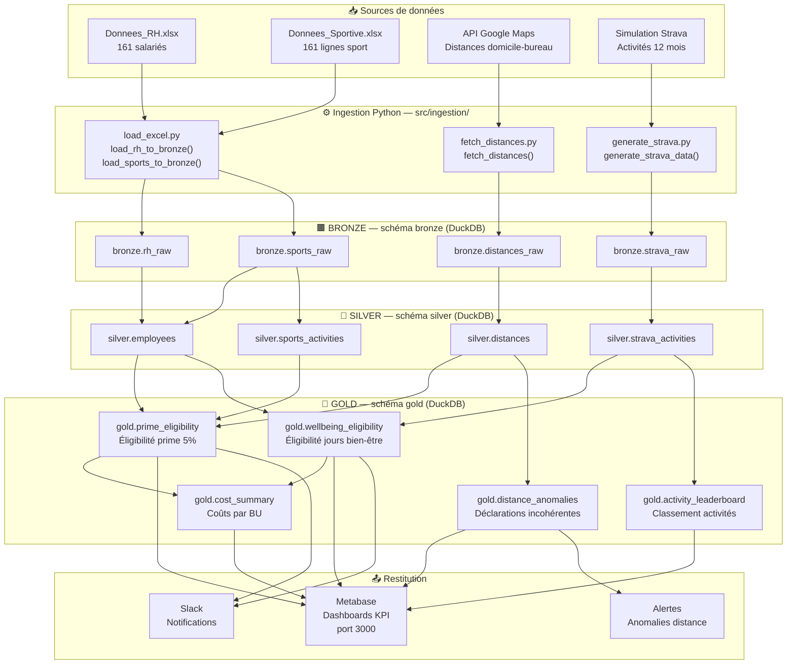
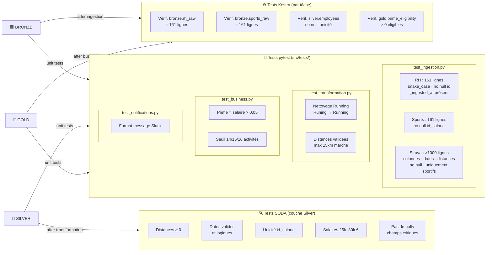
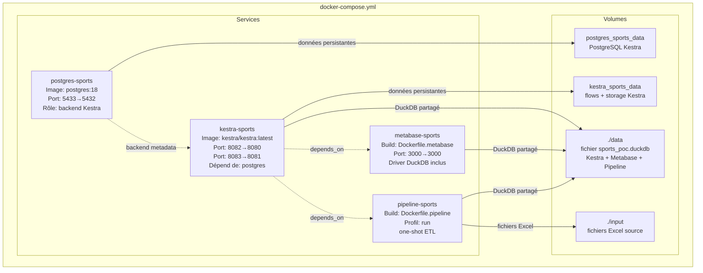
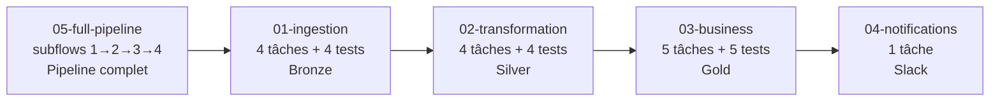

# Architecture technique — POC Avantages Sportifs

## Vue d'ensemble

Ce document détaille les choix d'architecture pour le POC Avantages Sportifs de Sport Data Solution.

## Principes directeurs

1. **Simplicité** : ne pas empiler les technologies, choisir des outils multi-fonctions
2. **Maintenabilité** : code modulaire, tests à chaque niveau, documentation vivante
3. **Scalabilité** : chaque composant a un chemin de montée en charge identifié
4. **Sécurité** : données RH sensibles, accès contrôlé, pas d'exposition publique

## Flux de données

### Pipeline global — Sources → Bronze → Silver → Gold → Restitution



### Flux de tests — SODA + pytest + Kestra



## Choix techniques détaillés

### DuckDB — Base de données

**Pourquoi DuckDB plutôt que PostgreSQL ou SQLite :**
- Moteur analytique (OLAP) optimisé pour les requêtes agrégées — parfait pour les KPI
- Zéro serveur : fichier unique, embarqué dans le process Python
- Lecture native des fichiers Excel, CSV, Parquet sans ETL externe
- SQL standard complet (window functions, CTEs, etc.)
- Organisation en schémas (bronze/silver/gold) dans un seul fichier
- Évolution naturelle vers MotherDuck (DuckDB cloud) sans changer le SQL

### Kestra — Orchestration

**Pourquoi Kestra plutôt qu'Airflow ou Prefect :**
- Un seul outil pour : orchestration, scheduling, monitoring, logs, alertes
- Flows déclarés en YAML (pas de code Python pour l'orchestration)
- UI web native pour la supervision et la démo live
- Variables d'environnement intégrées (paramètres dynamiques)
- Léger en ressources, démarrage rapide
- Pas besoin d'un outil de monitoring séparé

### Metabase — Visualisation

**Pourquoi Metabase plutôt que PowerBI ou Tableau :**
- Open-source, conteneurisable, pas de licence
- Connecteur DuckDB disponible (driver communautaire)
- Rafraîchissement automatique des données
- Démo live accessible via navigateur (localhost:3000)
- Alternative crédible en entreprise

### Docker Compose — Infrastructure

**Configuration des ports (évitement de conflits) :**
- Kestra UI : 8082 (interne 8080)
- Kestra API : 8083 (interne 8081)
- PostgreSQL Kestra : 5433 (interne 5432)
- Metabase : 3000

## Couche Bronze — Ingestion

### Module `src/ingestion/load_excel.py`

Deux fonctions principales, toutes deux basées sur `db_session` (gestionnaire de contexte DuckDB) :

| Fonction | Source | Table cible |
|----------|--------|-------------|
| `load_rh_to_bronze()` | `input/Donnees_RH.xlsx` | `bronze.rh_raw` |
| `load_sports_to_bronze()` | `input/Donnees_Sportive.xlsx` | `bronze.sports_raw` |

**Normalisation des colonnes :**
- Suppression des accents via `unicodedata.normalize("NFD")`
- Conversion en minuscules
- Remplacement des caractères non alphanumériques par `_`
- Exemples : `ID salarié` → `id_salarie`, `Prénom` → `prenom`, `Date d'embauche` → `date_d_embauche`

**Colonne technique ajoutée :** `_ingested_at` (timestamp UTC) sur chaque ligne.

**Création des tables :** `CREATE OR REPLACE TABLE` — idempotent, relançable sans effet de bord.

## Tests

### Stratégie à 3 niveaux

| Niveau | Outil | Cible | Exemple |
|--------|-------|-------|---------|
| Tâche Kestra | Assertions dans le flow | Chaque tâche produit un résultat | `bronze.rh_raw` contient 161 lignes |
| Qualité données | SODA Core | Couche Silver | Distance ≥ 0, dates valides |
| Unitaire | pytest | Fonctions Python | Calcul prime = salaire × 0.05 |

### Tests implémentés — Ingestion Bronze (`src/tests/test_ingestion.py`)

**RH & Sportif (Excel → Bronze)**

| Test | Table | Vérification |
|---|---|---|
| `test_load_rh_row_count` | `bronze.rh_raw` | Exactement 161 lignes |
| `test_load_rh_columns_snake_case` | `bronze.rh_raw` | Colonnes `[a-z0-9_]+` uniquement |
| `test_load_rh_no_null_id` | `bronze.rh_raw` | Aucun `id_salarie` null |
| `test_load_rh_has_ingested_at` | `bronze.rh_raw` | `_ingested_at` présent et non null |
| `test_load_sports_row_count` | `bronze.sports_raw` | Exactement 161 lignes |
| `test_load_sports_no_null_id` | `bronze.sports_raw` | Aucun `id_salarie` null |

**Simulation Strava (génération → Bronze)**

| Test | Table | Vérification |
|---|---|---|
| `test_strava_generation_row_count` | `bronze.strava_raw` | > 1 000 lignes |
| `test_strava_columns` | `bronze.strava_raw` | 7 colonnes exactes |
| `test_strava_no_null_required` | `bronze.strava_raw` | `id_salarie`, `date_debut`, `sport_type` non nuls |
| `test_strava_distance_positive` | `bronze.strava_raw` | `distance_m` > 0 quand non nulle |
| `test_strava_duration_positive` | `bronze.strava_raw` | `temps_ecoule_s` > 0 |
| `test_strava_date_range` | `bronze.strava_raw` | Toutes les dates dans les 12 derniers mois |
| `test_strava_only_sportifs` | `bronze.strava_raw` | Uniquement des salariés avec sport déclaré |

**Distances domicile-bureau (haversine/API → Bronze)**

| Test | Table | Vérification |
|---|---|---|
| `test_distances_row_count` | `bronze.distances_raw` | Exactement 68 lignes (sportifs) |
| `test_distances_columns` | `bronze.distances_raw` | 5 colonnes exactes |
| `test_distances_positive` | `bronze.distances_raw` | Toutes distances > 0 km |
| `test_distances_mode_coherent` | `bronze.distances_raw` | Marche → walking, Vélo → bicycling |
| `test_distances_no_null` | `bronze.distances_raw` | `id_salarie` et `distance_km` non nuls |
| `test_haversine_lattes` | _(unitaire)_ | Lattes → distance < 5 km |
| `test_haversine_nimes` | _(unitaire)_ | Nîmes → distance > 30 km |

Chaque test utilise une DB temporaire (`/tmp/test_ingestion.duckdb`) nettoyée avant et après exécution.
Le mode simulation haversine est utilisé en test (pas d'appel API réelle).

### Tests implémentés — Transformation Silver (`src/tests/test_transformation.py`)

Fixture `scope="module"` : Bronze chargé une fois, une distance anomalique injectée (walking 20 km > seuil 15 km), puis toutes les transformations Silver exécutées.

**silver.employees**

| Test | Vérification |
|---|---|
| `test_employees_row_count` | 161 lignes |
| `test_employees_is_sportif` | 68 salariés avec `is_sportif_deplacement = TRUE` |
| `test_employees_no_null_critical` | `id_salarie`, `nom`, `prenom`, `salaire_brut` non nuls |
| `test_employees_salary_range` | Salaires entre 20 000 et 100 000 € |
| `test_employees_has_transformed_at` | `_transformed_at` présente et non nulle |

**silver.sports_activities**

| Test | Vérification |
|---|---|
| `test_sports_row_count` | 161 lignes |
| `test_sports_no_runing` | Aucune valeur `'Runing'` (corrigée en `'Running'`) |
| `test_sports_has_sport_flag` | 95 salariés avec `has_sport = TRUE` |

**silver.distances**

| Test | Vérification |
|---|---|
| `test_distances_row_count` | 68 lignes |
| `test_distances_anomaly_detection` | ≥ 1 anomalie (`is_valid = FALSE`) |
| `test_distances_valid_have_no_reason` | `anomaly_reason` NULL quand `is_valid = TRUE` |
| `test_distances_invalid_have_reason` | `anomaly_reason` non NULL quand `is_valid = FALSE` |

**silver.strava_activities**

| Test | Vérification |
|---|---|
| `test_strava_row_count` | Même nombre que `bronze.strava_raw` |
| `test_strava_distance_km` | `distance_km = distance_m / 1000` (tolérance 0.001) |
| `test_strava_duree_minutes` | `duree_minutes = temps_ecoule_s / 60` (tolérance 0.01) |
| `test_strava_no_null_required` | `id_salarie`, `date_debut`, `sport_type` non nuls |

## Couche Silver — Transformation

### Modules `src/transformation/`

| Module | Fonction | Bronze → Silver |
|---|---|---|
| `clean_rh.py` | `clean_rh_to_silver()` | `rh_raw` → `employees` |
| `clean_sports.py` | `clean_sports_to_silver()` | `sports_raw` → `sports_activities` |
| `validate_distances.py` | `validate_distances_to_silver()` | `distances_raw` + `employees` → `distances` |
| `clean_strava.py` | `clean_strava_to_silver()` | `strava_raw` → `strava_activities` |
| `__init__.py` | `run_all_transformations()` | Orchestre les 4 modules dans l'ordre |

**Transformations clés :**

- `silver.employees` : dates castées en DATE, salaires en INTEGER, flag `is_sportif_deplacement`, trim des champs texte
- `silver.sports_activities` : correction "Runing" → "Running", flag `has_sport`
- `silver.distances` : validation vs seuils config (`WALK_MAX_KM=15`, `BIKE_MAX_KM=25`), colonnes `is_valid` et `anomaly_reason`
- `silver.strava_activities` : `distance_km = distance_m/1000`, `duree_minutes = temps_ecoule_s/60`

## Couche Gold — Calculs métier

### Modules `src/business/`

| Module | Fonction(s) | Silver → Gold |
|---|---|---|
| `compute_prime.py` | `compute_prime_eligibility()` | `employees` + `distances` → `prime_eligibility` |
| `compute_wellbeing.py` | `compute_wellbeing_eligibility()` | `employees` + `strava_activities` → `wellbeing_eligibility` |
| `detect_anomalies.py` | `detect_distance_anomalies()` | `distances` + `employees` → `distance_anomalies` |
| `build_summary.py` | `build_cost_summary()` + `build_activity_leaderboard()` | tables Gold → `cost_summary` + `activity_leaderboard` |
| `__init__.py` | `run_all_business()` | Orchestre les 5 fonctions dans l'ordre |

**Tables Gold produites :**

| Table | Périmètre | Colonnes clés |
|---|---|---|
| `gold.prime_eligibility` | 68 sportifs | `is_eligible`, `prime_montant`, `reason_ineligible` |
| `gold.wellbeing_eligibility` | 161 salariés | `activity_count`, `is_eligible`, `days_granted` |
| `gold.distance_anomalies` | Anomalies only | `distance_km`, `max_distance_km`, `anomaly_reason` |
| `gold.cost_summary` | 5 BU + TOTAL | `cout_prime_total`, `nb_wellbeing_eligible` |
| `gold.activity_leaderboard` | 161 salariés | `activity_count`, `classement` |

**Règles métier implémentées :**

- **Prime sportive** : `prime_montant = salaire_brut × PRIME_RATE` (0 si non éligible) — taux paramétrable
- **Jours bien-être** : `days_granted = 5` si `activity_count >= WELLBEING_THRESHOLD` — seuil paramétrable
- **Anomalies** : distance > seuil mode → logue en WARNING + insère dans `gold.distance_anomalies`
- **Résumé coûts** : agrégation par BU avec ligne TOTAL via `UNION ALL` dans une sous-requête
- **Classement** : `RANK() OVER (ORDER BY activity_count DESC)` — ex-aequo gérés

**Paramètres dynamiques (via `src/utils/config.py`) :**

| Paramètre | Défaut | Description |
|---|---|---|
| `PRIME_RATE` | 0.05 | Taux de la prime (5%) |
| `WELLBEING_THRESHOLD` | 15 | Seuil minimum d'activités |

### Tests implémentés — Calculs métier Gold (`src/tests/test_business.py`)

Fixture `scope="module"` : Bronze + anomalie injectée (walking 20 km) + Silver complet + Gold complet.

**gold.prime_eligibility**

| Test | Vérification |
|---|---|
| `test_prime_row_count` | 68 lignes (sportifs uniquement) |
| `test_prime_has_ineligible` | ≥ 1 non éligible (anomalie injectée) |
| `test_prime_eligible_have_nonzero_montant` | Éligibles ont prime_montant > 0 |
| `test_prime_ineligible_have_zero_montant` | Non éligibles ont prime_montant = 0 |
| `test_prime_calcul_taux_defaut` | prime_montant = salaire × 0.05 (tolérance 0.01) |
| `test_prime_ineligible_have_reason` | reason_ineligible non nul si non éligible |
| `test_prime_custom_rate` | Taux 10% → montants 2× supérieurs à 5% |

**gold.wellbeing_eligibility**

| Test | Vérification |
|---|---|
| `test_wellbeing_row_count` | 161 lignes (tous les salariés) |
| `test_wellbeing_has_eligible` | ≥ 1 éligible |
| `test_wellbeing_days_granted_binary` | days_granted ∈ {0, 5} uniquement |
| `test_wellbeing_consistency_eligible_days` | Cohérence is_eligible ↔ days_granted |
| `test_wellbeing_seuil_14_non_eligible` | Seuil 14 → éligibles ≥ seuil 15 |

**gold.distance_anomalies**

| Test | Vérification |
|---|---|
| `test_anomalies_has_at_least_one` | ≥ 1 anomalie détectée |
| `test_anomalies_have_reason` | anomaly_reason non nul |
| `test_anomalies_distance_exceeds_max` | distance_km > max_distance_km |

**gold.cost_summary**

| Test | Vérification |
|---|---|
| `test_cost_summary_row_count` | 6 lignes (5 BU + TOTAL) |
| `test_cost_summary_has_total_row` | Ligne 'TOTAL' présente |
| `test_cost_summary_total_coherent` | TOTAL.nb_total_salaries = 161 |
| `test_cost_summary_bu_names` | 5 BU : Finance, Marketing, R&D, Support, Ventes |

**gold.activity_leaderboard**

| Test | Vérification |
|---|---|
| `test_leaderboard_row_count` | 161 lignes |
| `test_leaderboard_classement_starts_at_one` | MIN(classement) = 1 |
| `test_leaderboard_non_sportifs_have_zero_activities` | Cohérence classement / activités |

## Docker — Images et déploiement

### Dockerfiles

| Fichier | Base | Rôle |
|---|---|---|
| `docker/Dockerfile.pipeline` | `python:3.11-slim` | Image pipeline ETL (Bronze→Silver→Gold) |
| `docker/metabase/Dockerfile.metabase` | `metabase/metabase:latest` + `debian:12-slim` | Metabase + driver DuckDB v1.5.1.0 |

**`docker/Dockerfile.pipeline`** — Image légère pour exécuter le pipeline :
- Installe les dépendances `requirements.txt` (sans cache pip)
- Copie `src/` et `main.py`
- `ENTRYPOINT ["python", "main.py"]`, `CMD ["run"]`
- Variables : `DUCKDB_PATH`, `PYTHONUNBUFFERED=1`

**`docker/metabase/Dockerfile.metabase`** — Build multi-étapes :
1. Stage `downloader` (debian:12-slim) : télécharge le JAR DuckDB driver v1.5.1.0 via `curl`
2. Stage final (metabase:latest) : copie le JAR dans `/plugins/`, `MB_PLUGINS_DIR=/plugins`

### Docker Compose — Services, ports et volumes



**Profil Docker `run`** : le service `pipeline-sports` ne démarre que si le profil est activé :
```bash
docker-compose --profile run up pipeline-sports
```

### Scripts de démarrage

| Script | Rôle |
|---|---|
| `scripts/start.sh` | Démarre l'infra, attend Metabase, lance le pipeline, affiche les URLs |
| `scripts/demo.sh` | Injecte une activité fictive, recalcule Gold, envoie la notification Slack |

```bash
chmod +x scripts/start.sh scripts/demo.sh
./scripts/start.sh    # Démarrage complet
./scripts/demo.sh     # Démo live
```

## Couche Notifications — Slack

### Module `src/notifications/slack_messenger.py`

| Fonction | Description |
|---|---|
| `format_activity_message()` | Génère un message Slack motivant (templates variés, hash MD5 déterministe) |
| `send_slack_message()` | POST webhook Slack ou dry-run si `SLACK_WEBHOOK_URL` absent |
| `notify_recent_activities()` | Notifie toutes les activités dans une fenêtre temporelle (défaut 24h) |
| `notify_single_activity()` | Notifie une activité spécifique par ID (démo live) |

**Variété des messages :**
- Index template = `MD5(nom) % len(templates)` → déterministe, reproductible, varié
- 4 templates avec distance (ex: Running, Cycling), 4 sans (ex: Tennis, Yoga)
- 8 phrases d'encouragement rotatives
- Emojis mappés par sport (16 sports couverts)
- Durée formatée : `< 60 min → "45 min"` | `>= 60 min → "1h30min"`

**Mode dry-run :** si `SLACK_WEBHOOK_URL` n'est pas défini dans `.env`,
les messages sont loggés en WARNING sans appel réseau — adapté au POC.

### Tests implémentés — Notifications (`src/tests/test_notifications.py`)

| Test | Vérification |
|---|---|
| `test_format_message_with_distance` | Distance en km (10800m → "10.8") et durée présents |
| `test_format_message_without_distance` | Nom du sport et durée présents (Tennis, 1h30) |
| `test_format_message_with_comment` | Commentaire entre guillemets en fin de message |
| `test_format_duration_minutes` | 1800 s → "30 min" (< 60 min) |
| `test_format_duration_hours` | 5400 s → "1h..." (>= 60 min) |
| `test_send_dry_run` | Sans webhook → retourne False, pas d'exception |
| `test_notify_recent_count` | count = nombre d'activités dans silver.strava_activities |

## Flows Kestra — Orchestration

### Structure des flows `kestra/flows/`



| Flow | ID Kestra | Tâches | Tests intégrés |
|---|---|---|---|
| `01_ingestion.yml` | `01-ingestion` | load_rh, load_sports, fetch_distances, generate_strava | 4 (lignes, nulls, positifs) |
| `02_transformation.yml` | `02-transformation` | clean_rh, clean_sports, validate_distances, clean_strava | 4 (lignes, sportifs, Runing, distance_km) |
| `03_business.yml` | `03-business` | compute_prime, compute_wellbeing, detect_anomalies, build_summary, build_leaderboard | 5 (lignes, montants, days_granted, total 161) |
| `04_notifications.yml` | `04-notifications` | notify_recent_activities | — (dry-run) |
| `05_full_pipeline.yml` | `05-full-pipeline` | Subflows 1→4 + print_summary | Via subflows |

**Volumes montés dans Kestra (docker-compose.yml) :**
- `./src` → `/app/src` — code source Python
- `./data` → `/app/data` — fichier DuckDB
- `./input` → `/app/input` — fichiers Excel source
- `./kestra/flows` → `/app/flows` — flows YAML chargés au démarrage

**Task runner :** `io.kestra.plugin.core.runner.Process` — exécution en subprocess
dans le conteneur Kestra, avec `sys.path.insert(0, '/app')` pour accéder à `src.*`.

**Paramètres dynamiques Kestra :**

| Variable | Défaut | Flow |
|---|---|---|
| `db_path` | `/app/data/sports_poc.duckdb` | Tous |
| `prime_rate` | `0.05` | 03-business |
| `wellbeing_threshold` | `15` | 03-business |
| `hours` | `24` | 04-notifications |

## CLI local — main.py

Script d'exécution du pipeline sans Kestra, via `argparse` :

```
python main.py run                        # Pipeline complet Bronze→Silver→Gold
python main.py run --notify               # + notifications Slack
python main.py run --prime-rate 0.08      # Taux prime override
python main.py run --threshold 10         # Seuil bien-être override
python main.py notify                     # Activités des 24 dernières heures
python main.py notify --id 42             # Activité spécifique (démo live)
python main.py status                     # Lignes par table DuckDB
```

**Résumé final affiché après `run` :**
```
=======================================================
  RÉSUMÉ PIPELINE — POC Avantages Sportifs
=======================================================
  Prime sportive    :   67 éligibles | Coût total :   168 966,50 €
  Jours bien-être   :   60 éligibles | 5 jours/an
  Anomalies distance:    1 détectée(s)
  Classement activités: 161 salariés classés
=======================================================
```

## Sécurité

- Données RH non versionnées sur GitHub (`.gitignore`)
- Fichiers Excel dans `input/` (local uniquement)
- Variables sensibles (clés API) dans `.env` (non versionné)
- DuckDB en volume Docker local, pas d'exposition réseau
