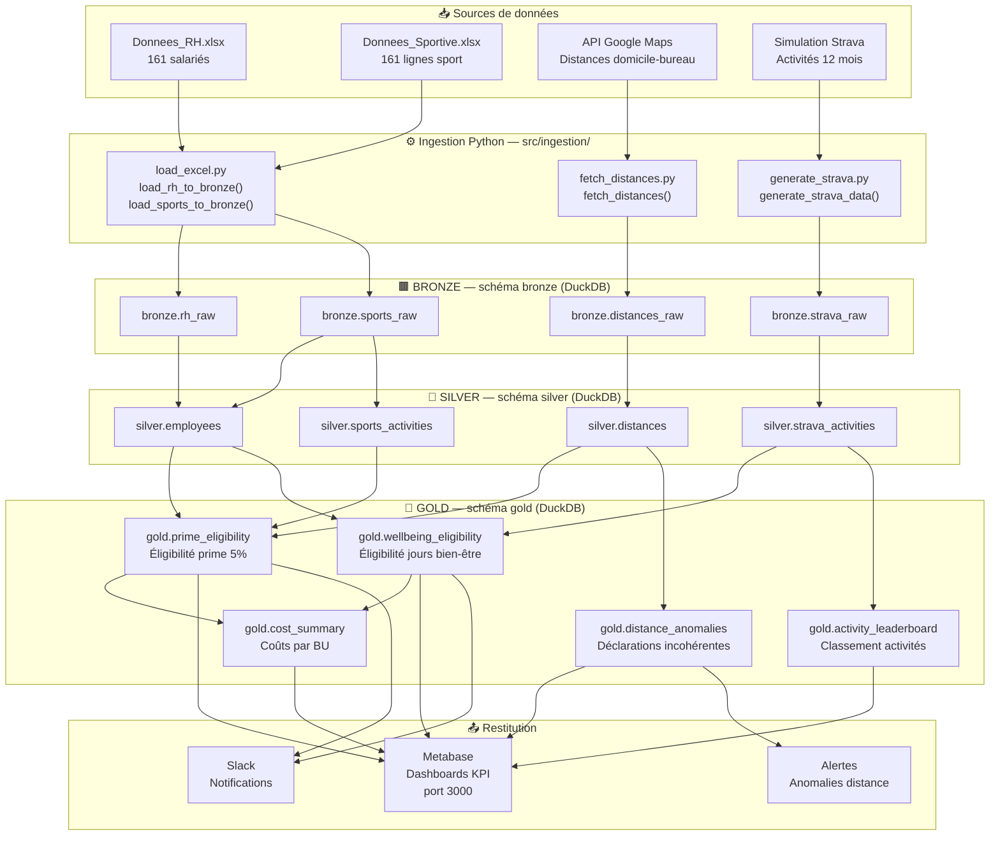
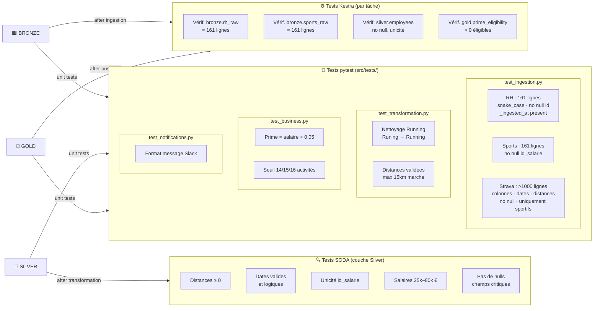
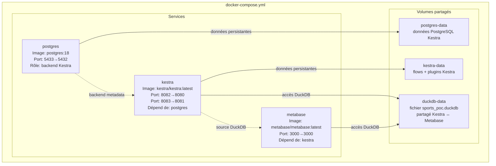

# Architecture technique — POC Avantages Sportifs

## Vue d'ensemble

Ce document détaille les choix d'architecture pour le POC Avantages Sportifs de Sport Data Solution.

## Principes directeurs

1. **Simplicité** : ne pas empiler les technologies, choisir des outils multi-fonctions
2. **Maintenabilité** : code modulaire, tests à chaque niveau, documentation vivante
3. **Scalabilité** : chaque composant a un chemin de montée en charge identifié
4. **Sécurité** : données RH sensibles, accès contrôlé, pas d'exposition publique

## Flux de données

### Pipeline global — Sources → Bronze → Silver → Gold → Restitution

### Flux de tests — SODA + pytest + Kestra

## Choix techniques détaillés

### DuckDB — Base de données

**Pourquoi DuckDB plutôt que PostgreSQL ou SQLite :**
- Moteur analytique (OLAP) optimisé pour les requêtes agrégées — parfait pour les KPI
- Zéro serveur : fichier unique, embarqué dans le process Python
- Lecture native des fichiers Excel, CSV, Parquet sans ETL externe
- SQL standard complet (window functions, CTEs, etc.)
- Organisation en schémas (bronze/silver/gold) dans un seul fichier
- Évolution naturelle vers MotherDuck (DuckDB cloud) sans changer le SQL

### Kestra — Orchestration

**Pourquoi Kestra plutôt qu'Airflow ou Prefect :**
- Un seul outil pour : orchestration, scheduling, monitoring, logs, alertes
- Flows déclarés en YAML (pas de code Python pour l'orchestration)
- UI web native pour la supervision et la démo live
- Variables d'environnement intégrées (paramètres dynamiques)
- Léger en ressources, démarrage rapide
- Pas besoin d'un outil de monitoring séparé

### Metabase — Visualisation

**Pourquoi Metabase plutôt que PowerBI ou Tableau :**
- Open-source, conteneurisable, pas de licence
- Connecteur DuckDB disponible (driver communautaire)
- Rafraîchissement automatique des données
- Démo live accessible via navigateur (localhost:3000)
- Alternative crédible en entreprise

### Docker Compose — Infrastructure

**Configuration des ports (évitement de conflits) :**
- Kestra UI : 8082 (interne 8080)
- Kestra API : 8083 (interne 8081)
- PostgreSQL Kestra : 5433 (interne 5432)
- Metabase : 3000

## Couche Bronze — Ingestion

### Module `src/ingestion/load_excel.py`

Deux fonctions principales, toutes deux basées sur `db_session` (gestionnaire de contexte DuckDB) :

| Fonction | Source | Table cible |
|----------|--------|-------------|
| `load_rh_to_bronze()` | `input/Donnees_RH.xlsx` | `bronze.rh_raw` |
| `load_sports_to_bronze()` | `input/Donnees_Sportive.xlsx` | `bronze.sports_raw` |

**Normalisation des colonnes :**
- Suppression des accents via `unicodedata.normalize("NFD")`
- Conversion en minuscules
- Remplacement des caractères non alphanumériques par `_`
- Exemples : `ID salarié` → `id_salarie`, `Prénom` → `prenom`, `Date d'embauche` → `date_d_embauche`

**Colonne technique ajoutée :** `_ingested_at` (timestamp UTC) sur chaque ligne.

**Création des tables :** `CREATE OR REPLACE TABLE` — idempotent, relançable sans effet de bord.

## Tests

### Stratégie à 3 niveaux

| Niveau | Outil | Cible | Exemple |
|--------|-------|-------|---------|
| Tâche Kestra | Assertions dans le flow | Chaque tâche produit un résultat | `bronze.rh_raw` contient 161 lignes |
| Qualité données | SODA Core | Couche Silver | Distance ≥ 0, dates valides |
| Unitaire | pytest | Fonctions Python | Calcul prime = salaire × 0.05 |

### Tests implémentés — Ingestion Bronze (`src/tests/test_ingestion.py`)

**RH & Sportif (Excel → Bronze)**

| Test | Table | Vérification |
|---|---|---|
| `test_load_rh_row_count` | `bronze.rh_raw` | Exactement 161 lignes |
| `test_load_rh_columns_snake_case` | `bronze.rh_raw` | Colonnes `[a-z0-9_]+` uniquement |
| `test_load_rh_no_null_id` | `bronze.rh_raw` | Aucun `id_salarie` null |
| `test_load_rh_has_ingested_at` | `bronze.rh_raw` | `_ingested_at` présent et non null |
| `test_load_sports_row_count` | `bronze.sports_raw` | Exactement 161 lignes |
| `test_load_sports_no_null_id` | `bronze.sports_raw` | Aucun `id_salarie` null |

**Simulation Strava (génération → Bronze)**

| Test | Table | Vérification |
|---|---|---|
| `test_strava_generation_row_count` | `bronze.strava_raw` | > 1 000 lignes |
| `test_strava_columns` | `bronze.strava_raw` | 7 colonnes exactes |
| `test_strava_no_null_required` | `bronze.strava_raw` | `id_salarie`, `date_debut`, `sport_type` non nuls |
| `test_strava_distance_positive` | `bronze.strava_raw` | `distance_m` > 0 quand non nulle |
| `test_strava_duration_positive` | `bronze.strava_raw` | `temps_ecoule_s` > 0 |
| `test_strava_date_range` | `bronze.strava_raw` | Toutes les dates dans les 12 derniers mois |
| `test_strava_only_sportifs` | `bronze.strava_raw` | Uniquement des salariés avec sport déclaré |

**Distances domicile-bureau (haversine/API → Bronze)**

| Test | Table | Vérification |
|---|---|---|
| `test_distances_row_count` | `bronze.distances_raw` | Exactement 68 lignes (sportifs) |
| `test_distances_columns` | `bronze.distances_raw` | 5 colonnes exactes |
| `test_distances_positive` | `bronze.distances_raw` | Toutes distances > 0 km |
| `test_distances_mode_coherent` | `bronze.distances_raw` | Marche → walking, Vélo → bicycling |
| `test_distances_no_null` | `bronze.distances_raw` | `id_salarie` et `distance_km` non nuls |
| `test_haversine_lattes` | _(unitaire)_ | Lattes → distance < 5 km |
| `test_haversine_nimes` | _(unitaire)_ | Nîmes → distance > 30 km |

Chaque test utilise une DB temporaire (`/tmp/test_ingestion.duckdb`) nettoyée avant et après exécution.
Le mode simulation haversine est utilisé en test (pas d'appel API réelle).

## Docker Compose — Services, ports et volumes

## Sécurité

- Données RH non versionnées sur GitHub (`.gitignore`)
- Fichiers Excel dans `input/` (local uniquement)
- Variables sensibles (clés API) dans `.env` (non versionné)
- DuckDB en volume Docker local, pas d'exposition réseau
