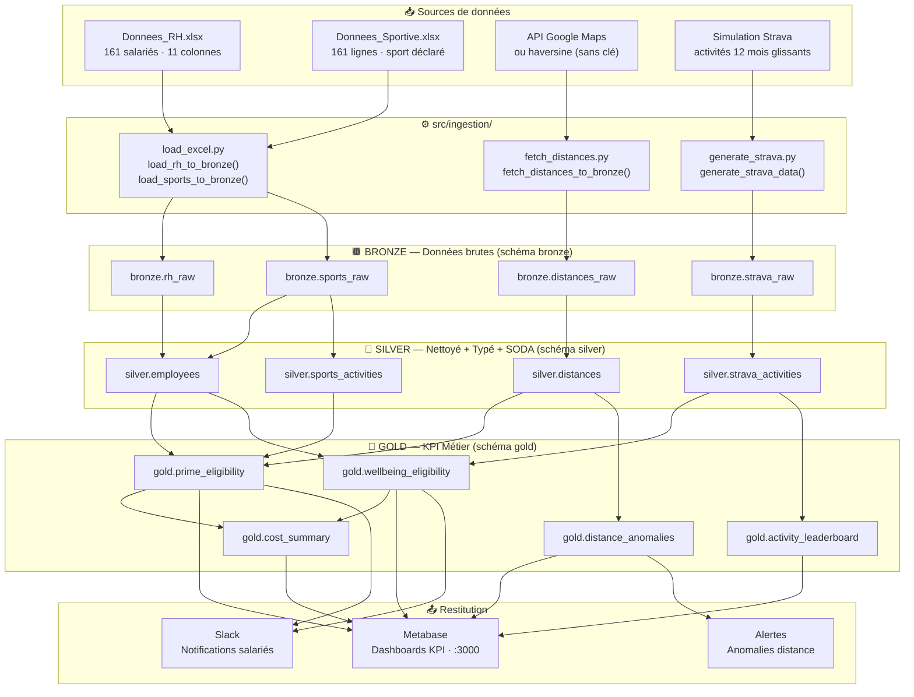
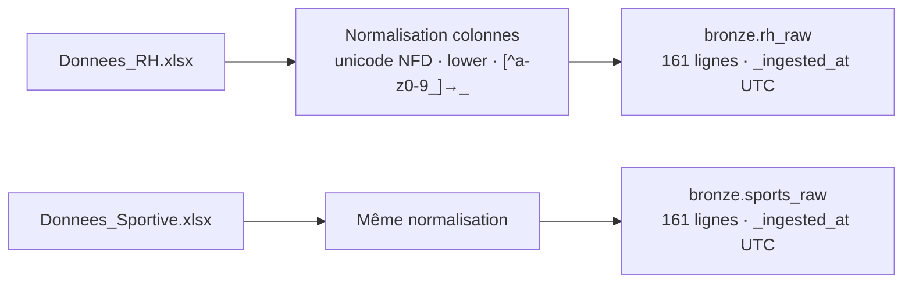
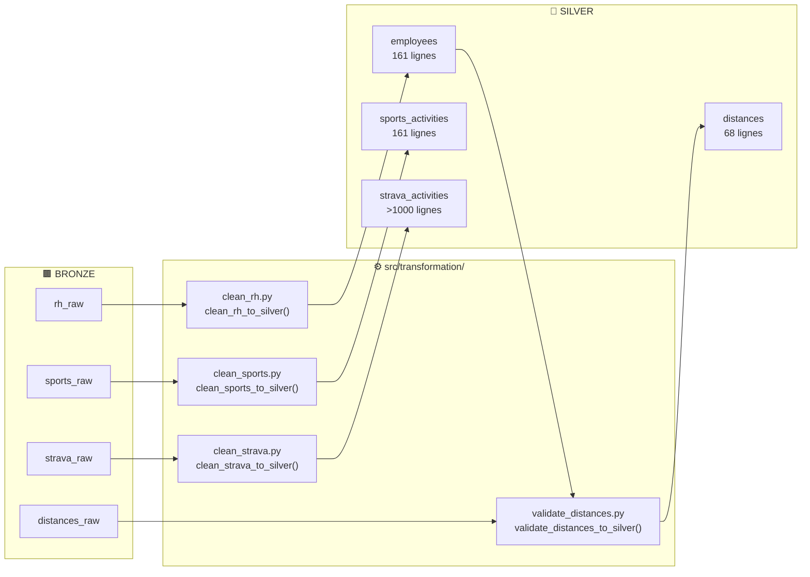
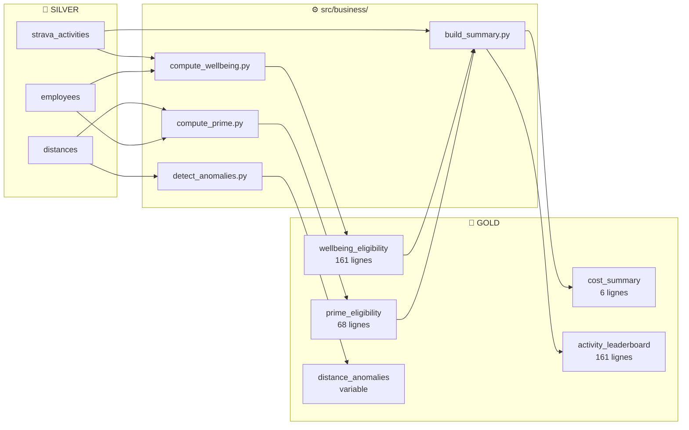
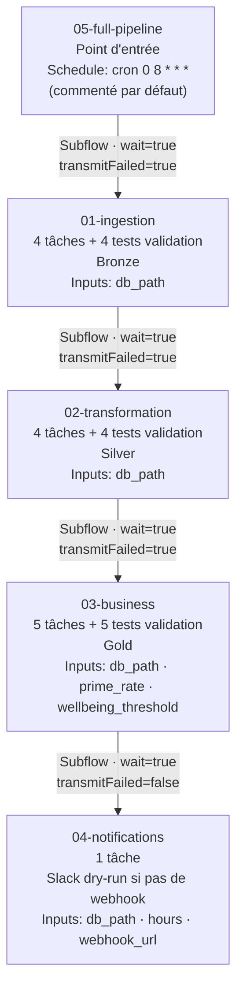
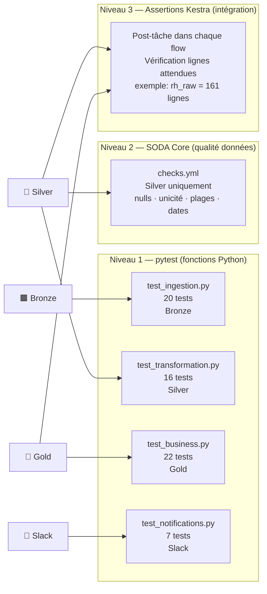
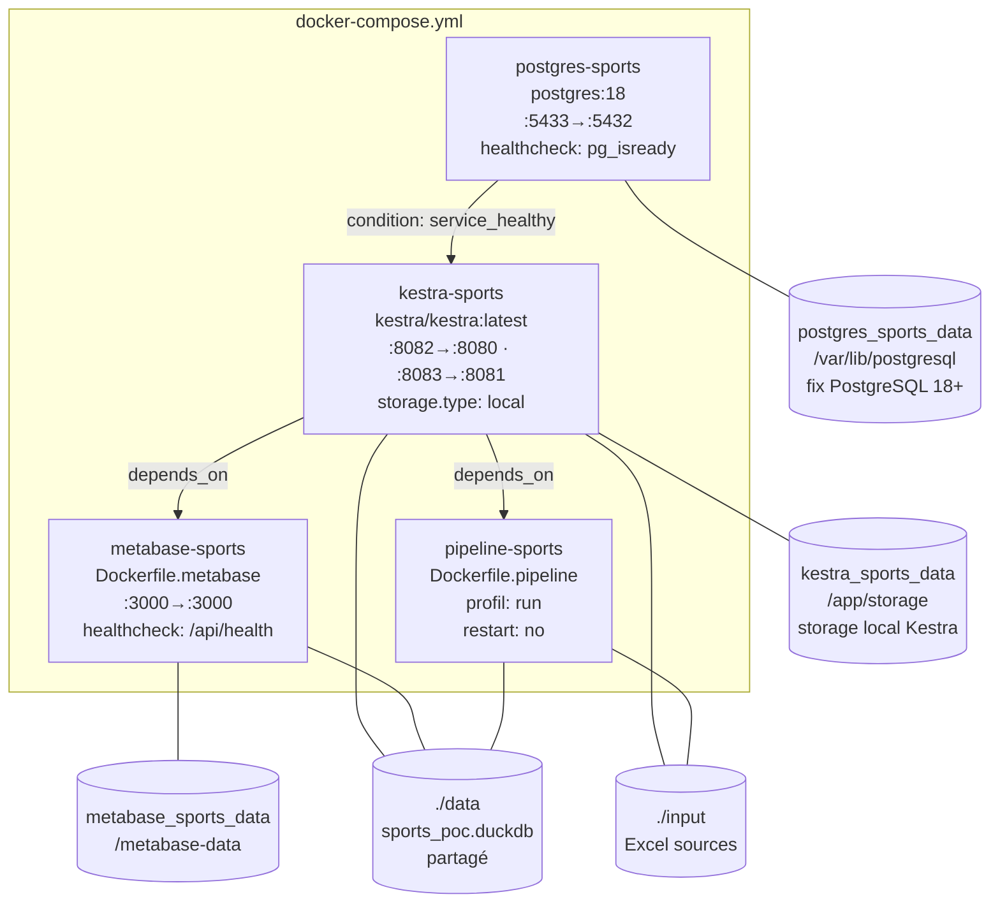

# Architecture technique — POC Avantages Sportifs

*Documentation technique détaillée du pipeline Bronze → Silver → Gold.*
*Pour la documentation utilisateur, voir le [README](../README.md).*

---

## Table des matières

- 1. [Vue d'ensemble](#vue-densemble)
  - 1.1 [Principes directeurs](#principes-directeurs)
  - 1.2 [Flux de données global](#flux-de-données-global)
- 2. [Choix techniques](#choix-techniques)
  - 2.1 [DuckDB](#duckdb--base-de-données-analytique)
  - 2.2 [Kestra](#kestra--orchestration)
  - 2.3 [Metabase](#metabase--visualisation)
  - 2.4 [Docker Compose](#docker-compose--infrastructure)
- 3. [Couche Bronze — Ingestion](#couche-bronze--ingestion)
- 4. [Couche Silver — Transformation](#couche-silver--transformation)
- 5. [Couche Gold — Calculs métier](#couche-gold--calculs-métier)
- 6. [Couche Notifications — Slack](#couche-notifications--slack)
- 7. [Flows Kestra — Orchestration](#flows-kestra--orchestration)
- 8. [CLI local — main.py](#cli-local--mainpy)
- 9. [Tests — Stratégie à 3 niveaux](#tests--stratégie-à-3-niveaux)
- 10. [Docker — Images et déploiement](#docker--images-et-déploiement)
- 11. [Problèmes rencontrés et solutions](#problèmes-rencontrés-et-solutions)
- 12. [Sécurité](#sécurité)

---

## Vue d'ensemble

### Principes directeurs

1. **Simplicité** : ne pas empiler les technologies, choisir des outils multi-fonctions
2. **Maintenabilité** : code modulaire, tests à chaque niveau, documentation vivante
3. **Scalabilité** : chaque composant a un chemin de montée en charge identifié
4. **Sécurité** : données RH sensibles, accès contrôlé, pas d'exposition publique

### Flux de données global



[↑ Retour au sommaire](#table-des-matières)

---

## Choix techniques

### DuckDB — Base de données analytique

**Pourquoi DuckDB plutôt que PostgreSQL ou SQLite :**

| Critère | DuckDB | PostgreSQL | SQLite |
|---------|--------|------------|--------|
| Zéro serveur | ✅ | ❌ | ✅ |
| Moteur OLAP (agrégations) | ✅ | Partiel | ❌ |
| Schemas multiples (bronze/silver/gold) | ✅ | ✅ | ❌ |
| Lecture native Excel/Parquet | ✅ | ❌ | ❌ |
| Window functions (RANK, LAG) | ✅ | ✅ | Partiel |
| Evolution cloud | MotherDuck | RDS | — |

**Décisions d'implémentation :**
- `CREATE OR REPLACE TABLE` — idempotent, relançable à tout moment
- Schémas séparés (`bronze`, `silver`, `gold`) dans un seul fichier `.duckdb`
- `db_session()` : context manager Python pour garantir la fermeture de connexion

### Kestra — Orchestration

**Pourquoi Kestra plutôt qu'Airflow ou Prefect :**
- Un seul outil pour : orchestration, scheduling, monitoring, logs, alertes, retry
- Flows déclarés en YAML (pas de code Python pour l'orchestration)
- UI web native pour la supervision et la démo live (localhost:8082)
- Variables d'environnement intégrées (`{{ vars.prime_rate }}`)
- Léger en ressources, démarrage rapide sans workers séparés
- `transmitFailed: false` sur les notifications → un échec Slack ne stoppe pas le pipeline

### Metabase — Visualisation

**Pourquoi Metabase plutôt que PowerBI ou Tableau :**
- Open-source, conteneurisable, pas de licence
- Driver DuckDB communautaire (JAR v1.5.1.0 intégré dans l'image Docker)
- Rafraîchissement automatique des requêtes après chaque run pipeline
- Démo live accessible via navigateur (localhost:3000)
- Alternative crédible en entreprise

### Docker Compose — Infrastructure

**Ports configurés (évitement de conflits avec d'autres services locaux) :**

| Service | Port interne | Port exposé | Raison |
|---------|-------------|-------------|--------|
| Kestra UI | 8080 | **8082** | Évite conflit avec d'autres Kestra |
| Kestra API | 8081 | **8083** | — |
| PostgreSQL | 5432 | **5433** | Évite conflit avec PostgreSQL local |
| Metabase | 3000 | **3000** | Standard |

[↑ Retour au sommaire](#table-des-matières)

---

## Couche Bronze — Ingestion

### Module `src/ingestion/load_excel.py`



**Normalisation des colonnes :**

| Colonne source | Colonne normalisée |
|---------------|-------------------|
| `ID salarié` | `id_salarie` |
| `Prénom` | `prenom` |
| `Date d'embauche` | `date_d_embauche` |
| `Salaire Brut` | `salaire_brut` |

**Principes :**
- `unicodedata.normalize("NFD")` pour supprimer les accents
- `re.sub(r"[^a-z0-9_]", "_", ...)` pour les caractères spéciaux
- `_ingested_at` : timestamp UTC ajouté sur chaque ligne
- `CREATE OR REPLACE TABLE` : idempotent

### Module `src/ingestion/fetch_distances.py`

Calcule la distance domicile-bureau pour les 68 salariés avec mode sportif.

**Deux modes :**

| Mode | Condition | Précision | Coût |
|------|-----------|-----------|------|
| **Haversine** | `GOOGLE_MAPS_API_KEY` absent | Approximatif (vol d'oiseau) | Gratuit |
| **Google Maps Distance Matrix** | Clé API configurée | Réel (routier/piéton/vélo) | Payant après free tier |

Adresse de référence : `1362 Avenue des Platanes, 34970 Lattes`

**Modes de déplacement mappés :**
- `'Marche/running'` → `walking` (Google Maps)
- `'Vélo/Trottinette/Autres'` → `bicycling`

### Module `src/ingestion/generate_strava.py`

Génère une simulation réaliste d'activités sportives sur les 12 mois glissants :
- Uniquement pour les 68 salariés avec mode sportif (`is_sportif_deplacement = TRUE`)
- Sport aléatoire pondéré (Running, Cycling, Yoga, Tennis...)
- Distance et durée cohérentes avec le sport
- Date de début uniformément distribuée sur 365 jours

[↑ Retour au sommaire](#table-des-matières)

---

## Couche Silver — Transformation

### Flux de transformation



### Transformations détaillées

**`silver.employees`** (`clean_rh_to_silver`) :
- `date_naissance`, `date_embauche` → `DATE` (cast SQL)
- `salaire_brut` → `INTEGER` (suppression virgules)
- `is_sportif_deplacement = TRUE` si `moyen_deplacement` ∈ `{'Marche/running', 'Vélo/Trottinette/Autres'}`
- `TRIM()` sur tous les champs texte
- `_transformed_at` : timestamp UTC ajouté

**`silver.sports_activities`** (`clean_sports_to_silver`) :
- Correction coquille : `'Runing'` → `'Running'`
- `has_sport = TRUE` si sport non nul et non `'Aucun'`

**`silver.distances`** (`validate_distances_to_silver`) :
- `is_valid = TRUE` si distance dans les seuils du mode :
  - Marche/running : ≤ `WALK_MAX_DISTANCE_KM` (défaut : 15 km)
  - Vélo/Trottinette : ≤ `BIKE_MAX_DISTANCE_KM` (défaut : 25 km)
- `anomaly_reason` : message descriptif si `is_valid = FALSE`
- Jointure avec `silver.employees` pour récupérer le mode de déplacement

**`silver.strava_activities`** (`clean_strava_to_silver`) :
- `distance_km = distance_m / 1000.0`
- `duree_minutes = temps_ecoule_s / 60.0`
- Filtre : uniquement les activités avec `date_debut` non nulle

[↑ Retour au sommaire](#table-des-matières)

---

## Couche Gold — Calculs métier

### Flux de calcul



### Tables Gold — structure et règles

**`gold.prime_eligibility`** — `compute_prime_eligibility()` :

| Colonne | Type | Règle |
|---------|------|-------|
| `id_salarie` | VARCHAR | Clé — 68 sportifs uniquement |
| `is_eligible` | BOOLEAN | `= silver.distances.is_valid` |
| `prime_montant` | DOUBLE | `salaire_brut × PRIME_RATE` si éligible, sinon `0` |
| `reason_ineligible` | VARCHAR | `anomaly_reason` copié si `is_valid = FALSE` |

**`gold.wellbeing_eligibility`** — `compute_wellbeing_eligibility()` :

| Colonne | Type | Règle |
|---------|------|-------|
| `id_salarie` | VARCHAR | Clé — 161 salariés (LEFT JOIN) |
| `activity_count` | INTEGER | `COUNT(strava_activities)` |
| `is_eligible` | BOOLEAN | `activity_count >= WELLBEING_THRESHOLD` |
| `days_granted` | INTEGER | `5` si éligible, sinon `0` |

**`gold.cost_summary`** — `build_cost_summary()` :
- Agrégation par BU : `SUM(prime_montant)`, `COUNT(*)` éligibles prime, `COUNT(*)` éligibles bien-être
- Ligne `TOTAL` via `UNION ALL` dans un CTE `unioned` (contournement limitation DuckDB ORDER BY)
- `ORDER BY CASE WHEN bu = 'TOTAL' THEN 1 ELSE 0 END, bu`

**`gold.activity_leaderboard`** — `build_activity_leaderboard()` :
- `RANK() OVER (ORDER BY activity_count DESC)` — ex-aequo gérés
- Jointure `silver.employees` + `silver.strava_activities` COUNT

[↑ Retour au sommaire](#table-des-matières)

---

## Couche Notifications — Slack

### Module `src/notifications/slack_messenger.py`

| Fonction | Description |
|----------|-------------|
| `format_activity_message()` | Génère un message Slack motivant |
| `send_slack_message()` | POST webhook ou dry-run si `SLACK_WEBHOOK_URL` absent |
| `notify_recent_activities()` | Notifie toutes les activités dans une fenêtre temporelle |
| `notify_single_activity()` | Notifie une activité spécifique par ID |

**Génération des messages :**
- Index template = `MD5(nom_salarie) % len(templates)` → déterministe, reproductible, varié
- 4 templates avec distance (Running, Cycling) + 4 sans (Tennis, Yoga)
- Emojis mappés par sport (16 sports couverts)
- Durée formatée : `< 60 min → "45 min"` | `≥ 60 min → "1h30min"`

**Mode dry-run :**

```python
def send_slack_message(message, webhook_url=None) -> bool:
    url = webhook_url or os.getenv("SLACK_WEBHOOK_URL", "")
    if not url:
        logger.warning("Mode dry-run : SLACK_WEBHOOK_URL non configuré")
        return False
    requests.post(url, json={"text": message}, timeout=10)
    return True
```

[↑ Retour au sommaire](#table-des-matières)

---

## Flows Kestra — Orchestration

### Dépendances entre flows



**Note `transmitFailed=false` sur `04-notifications`** : un échec Slack (réseau, webhook invalide) ne propage pas l'erreur au flow parent et ne marque pas le pipeline comme échoué.

### Task runner Kestra

```yaml
taskRunner:
  type: io.kestra.plugin.core.runner.Process
```

Chaque tâche Python s'exécute en subprocess dans le conteneur Kestra :

```python
import sys
sys.path.insert(0, "{{ vars.project_root }}")  # /app
from src.ingestion.load_excel import load_rh_to_bronze
load_rh_to_bronze("{{ vars.db_path }}")
```

### Paramètres dynamiques Kestra

| Variable | Valeur par défaut | Flows concernés |
|----------|-------------------|----------------|
| `db_path` | `/app/data/sports_poc.duckdb` | Tous |
| `project_root` | `/app` | Tous |
| `prime_rate` | `0.05` | `03-business`, `05-full-pipeline` |
| `wellbeing_threshold` | `15` | `03-business`, `05-full-pipeline` |
| `hours` | `24` | `04-notifications` |
| `webhook_url` | *(vide)* | `04-notifications` |

[↑ Retour au sommaire](#table-des-matières)

---

## CLI local — main.py

Script d'exécution du pipeline sans Kestra, via `argparse` :

```bash
python main.py run                        # Pipeline complet Bronze→Silver→Gold
python main.py run --notify               # + notifications Slack
python main.py run --prime-rate 0.08      # Override taux prime (8%)
python main.py run --threshold 10         # Override seuil bien-être
python main.py notify                     # Activités des 24 dernières heures
python main.py notify --id 42             # Activité spécifique (démo live)
python main.py status                     # Nombre de lignes par table DuckDB
```

**Architecture argparse :**
- `--db-path` : option globale sur le parseur parent (avant la sous-commande)
- `--prime-rate`, `--threshold` : options sur le sous-parseur `run` uniquement

> ⚠️ Correction appliquée : ces options doivent être sur le sous-parseur `run`, pas sur le parseur parent, pour être utilisables après le nom de la sous-commande (`python main.py run --prime-rate 0.08`).

**Résumé final affiché après `run` :**

```
=======================================================
  RÉSUMÉ PIPELINE — POC Avantages Sportifs
=======================================================
  Prime sportive    :   67 éligibles | Coût total :   168 966,50 €
  Jours bien-être   :   60 éligibles | 5 jours/an
  Anomalies distance:    1 détectée(s)
  Classement activités: 161 salariés classés
=======================================================
```

[↑ Retour au sommaire](#table-des-matières)

---

## Tests — Stratégie à 3 niveaux

### Vue d'ensemble



### Détail — test_ingestion.py (20 tests)

**RH & Sportif (Excel → Bronze)**

| Test | Vérification |
|------|-------------|
| `test_load_rh_row_count` | `bronze.rh_raw` = exactement 161 lignes |
| `test_load_rh_columns_snake_case` | Toutes colonnes `[a-z0-9_]+` |
| `test_load_rh_no_null_id` | `id_salarie` non nul |
| `test_load_rh_has_ingested_at` | `_ingested_at` présent et non nul |
| `test_load_sports_row_count` | `bronze.sports_raw` = 161 lignes |
| `test_load_sports_no_null_id` | `id_salarie` non nul |

**Strava & Distances**

| Test | Vérification |
|------|-------------|
| `test_strava_generation_row_count` | > 1 000 lignes |
| `test_strava_columns` | 7 colonnes exactes |
| `test_strava_date_range` | Toutes dates dans les 12 derniers mois |
| `test_strava_only_sportifs` | Uniquement IDs avec sport déclaré |
| `test_distances_row_count` | Exactement 68 lignes (sportifs) |
| `test_distances_positive` | `distance_km > 0` |
| `test_haversine_lattes` | Lattes → distance < 5 km |
| `test_haversine_nimes` | Nîmes → distance > 30 km |

### Détail — test_transformation.py (16 tests)

Fixture `scope="module"` : Bronze chargé une fois, **anomalie injectée** (`UPDATE bronze.distances_raw SET distance_km = 20.0` sur un marcheur), toutes les transformations Silver exécutées.

| Test | Vérification |
|------|-------------|
| `test_employees_row_count` | 161 lignes |
| `test_employees_is_sportif` | 68 avec `is_sportif_deplacement = TRUE` |
| `test_employees_salary_range` | Salaires entre 20 000 et 100 000 € |
| `test_sports_no_runing` | Aucun `'Runing'` (corrigé en `'Running'`) |
| `test_distances_anomaly_detection` | ≥ 1 `is_valid = FALSE` (anomalie injectée) |
| `test_distances_valid_have_no_reason` | `anomaly_reason = NULL` si `is_valid = TRUE` |
| `test_strava_distance_km` | `distance_km = distance_m / 1000` (tolérance 0.001) |
| `test_strava_duree_minutes` | `duree_minutes = temps_ecoule_s / 60` |

### Détail — test_business.py (22 tests)

Fixture `scope="module"` : Bronze + anomalie + Silver + Gold complet.

| Test | Vérification |
|------|-------------|
| `test_prime_row_count` | 68 lignes (sportifs uniquement) |
| `test_prime_calcul_taux_defaut` | `prime_montant = salaire × 0.05` (tolérance 0.01) |
| `test_prime_custom_rate` | Taux 10 % → montants ≈ 2× supérieurs à 5 % |
| `test_wellbeing_row_count` | 161 lignes (tous salariés, LEFT JOIN) |
| `test_wellbeing_days_granted_binary` | `days_granted` ∈ {0, 5} uniquement |
| `test_wellbeing_seuil_14_non_eligible` | Seuil 14 → éligibles ≥ ceux du seuil 15 |
| `test_cost_summary_row_count` | 6 lignes (5 BU + TOTAL) |
| `test_cost_summary_bu_names` | 5 BU : Finance, Marketing, R&D, Support, Ventes |
| `test_leaderboard_classement_starts_at_one` | `MIN(classement) = 1` |

### Détail — test_notifications.py (7 tests)

| Test | Vérification |
|------|-------------|
| `test_format_message_with_distance` | Distance en km et durée présentes dans le message |
| `test_format_message_without_distance` | Nom du sport et durée présents (Tennis, 1h30) |
| `test_format_message_with_comment` | Commentaire entre guillemets en fin de message |
| `test_format_duration_minutes` | `1800 s → "30 min"` |
| `test_format_duration_hours` | `5400 s → "1h..."` |
| `test_send_dry_run` | Sans webhook → `False`, pas d'exception |
| `test_notify_recent_count` | count = `COUNT(*) FROM silver.strava_activities` |

[↑ Retour au sommaire](#table-des-matières)

---

## Docker — Images et déploiement

### Dockerfiles

| Fichier | Base | Rôle |
|---------|------|------|
| `docker/Dockerfile.pipeline` | `python:3.11-slim` | Image pipeline ETL Bronze→Silver→Gold |
| `docker/metabase/Dockerfile.metabase` | `metabase/metabase:latest` + `debian:12-slim` | Metabase avec driver DuckDB v1.5.1.0 |

**`docker/Dockerfile.pipeline`** :
```dockerfile
FROM python:3.11-slim
WORKDIR /app
COPY requirements.txt .
RUN pip install --no-cache-dir -r requirements.txt
COPY src/ ./src/
COPY main.py .
RUN mkdir -p /app/data /app/input
ENV DUCKDB_PATH=/app/data/sports_poc.duckdb
ENTRYPOINT ["python", "main.py"]
CMD ["run"]
```

**`docker/metabase/Dockerfile.metabase`** — Build multi-étapes :
1. Stage `downloader` (debian:12-slim) : télécharge le JAR depuis GitHub via `curl`
2. Stage final (metabase:latest) : copie le JAR dans `/plugins/`

### Services Docker Compose



**Corrections appliquées :**

| Problème | Ancienne valeur | Valeur corrigée |
|----------|-----------------|-----------------|
| Volume PostgreSQL 18+ | `/var/lib/postgresql/data` | `/var/lib/postgresql` |
| Kestra storage | absent | `storage.type: local · base-path: /app/storage` |
| Driver DuckDB Metabase | volume vide `./docker/metabase/plugins` | Build multi-stage Dockerfile |

[↑ Retour au sommaire](#table-des-matières)

---

## Problèmes rencontrés et solutions

### 1. PostgreSQL 18+ — incompatibilité de volume

**Contexte :** PostgreSQL 18 a modifié sa structure interne de stockage. Le répertoire `data/` est créé dans un sous-dossier de `PGDATA`, qui n'est plus `/var/lib/postgresql/data` mais un sous-dossier variable.

**Symptôme :**
```
initdb: error: directory "/var/lib/postgresql/data" exists but is not empty
```

**Solution :** Monter le volume sur `/var/lib/postgresql` et laisser PostgreSQL créer sa propre arborescence :

```yaml
volumes:
  - postgres_sports_data:/var/lib/postgresql    # ✅
  # - postgres_sports_data:/var/lib/postgresql/data  # ❌
```

**Si le volume existant est corrompu depuis une ancienne installation :**
```bash
docker-compose down -v && docker-compose up -d
```

**Commit :** `fix(docker): correction du volume PostgreSQL 18+ (/var/lib/postgresql au lieu de /data)`

---

### 2. Kestra — configuration storage obligatoire

**Contexte :** En mode `server standalone`, Kestra exige une configuration explicite du backend de stockage des outputs de tâches depuis les versions récentes. Sans cette config, le serveur démarre mais les flows échouent à l'écriture des logs/outputs.

**Symptôme :**
```
No bean of type [io.kestra.core.storages.StorageInterface] found
```

**Solution :** Ajouter le bloc `storage` dans `KESTRA_CONFIGURATION` :

```yaml
KESTRA_CONFIGURATION: |
  kestra:
    storage:
      type: local
      local:
        base-path: /app/storage
    repository:
      type: postgres
    queue:
      type: postgres
```

**Commit :** `fix(docker): ajout effectif de la configuration storage locale Kestra`

---

### 3. DuckDB — ORDER BY dans UNION ALL

**Contexte :** DuckDB (contrairement à PostgreSQL) interdit un `ORDER BY` directement appliqué sur le résultat d'un `UNION ALL`. La table `gold.cost_summary` doit afficher TOTAL en dernier.

**Erreur :**
```
BinderException: Could not ORDER BY column "CASE WHEN bu = 'TOTAL' THEN 1 ELSE 0 END"
```

**Solution :** Envelopper le `UNION ALL` dans un CTE avant d'appliquer `ORDER BY` :

```sql
WITH bu_data AS (...),
totals AS (...),
unioned AS (
    SELECT * FROM bu_data
    UNION ALL
    SELECT * FROM totals
)
SELECT * FROM unioned
ORDER BY CASE WHEN bu = 'TOTAL' THEN 1 ELSE 0 END, bu
```

---

### 4. argparse — options globales vs options de sous-commande

**Contexte :** En argparse Python, les options définies sur le parseur **parent** doivent être placées **avant** le nom de la sous-commande dans la ligne de commande. Définir `--prime-rate` sur le parseur parent empêche `python main.py run --prime-rate 0.08`.

**Erreur utilisateur :**
```bash
python main.py run --prime-rate 0.08
# error: unrecognized arguments: --prime-rate
```

**Solution :** Déplacer `--prime-rate` et `--threshold` sur le sous-parseur `run` uniquement :

```python
run_parser.add_argument("--prime-rate", type=float, default=None)
run_parser.add_argument("--threshold", type=int, default=None)
# Et non plus sur parser.add_argument(...)
```

**Commit :** `fix(pipeline): correction argparse --prime-rate et --threshold après la sous-commande run`

[↑ Retour au sommaire](#table-des-matières)

---

## Sécurité

- **Données RH** non versionnées sur GitHub — `data/` et `*.duckdb` dans `.gitignore`
- **Fichiers Excel** dans `input/` (local uniquement, non commités)
- **Variables sensibles** (clés API, webhook) dans `.env` (non versionné — `.env.example` versionné)
- **DuckDB** en volume Docker local, pas d'exposition réseau externe
- **PostgreSQL Kestra** accessible uniquement en interne Docker (réseau `default`)

[↑ Retour au sommaire](#table-des-matières)
